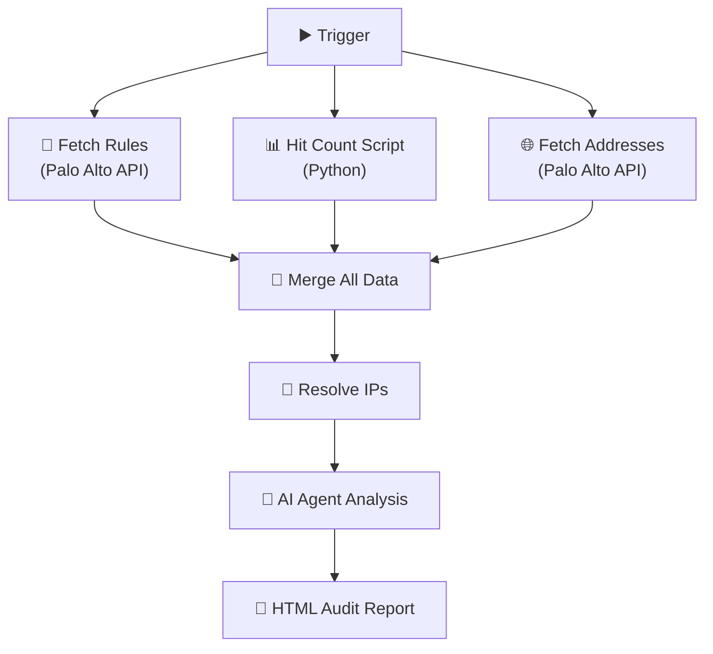

<div align="center">


<br/>


</div>


# Project 15: AI Firewall Rulebase Audit (n8n + Palo Alto)
**Platform:** n8n + Palo Alto Networks REST API + AI Agent (OpenAI/Claude) | **Duration:** 2-3 weeks | **Difficulty:** Advanced

---

## Project Overview


Firewall rulebases grow over time 📈 — rules accumulate, exceptions proliferate, and unused policies create hidden attack surfaces. This project automates the entire audit lifecycle: security rules fetched via **Palo Alto REST API** 🔐, enriched with hit count statistics 📊, and analyzed by an **AI agent** 🤖 that identifies risky rules, misconfigurations, and generates a styled HTML security report.

**This project proves you can:**
- Integrate with enterprise firewall APIs for automated policy extraction
- Build multi-source data enrichment pipelines in n8n (rules + stats + addresses)
- Apply AI/LLM agents to real security audit workflows (prompt engineering)
- Generate professional, stakeholder-ready HTML audit reports
- Identify overly permissive rules, unused policies, and misconfigurations at scale

**The Impact:** Transform a manual, multi-day rulebase review into a fully automated pipeline that produces an executive-ready audit report in minutes.

<br clear="right"/>


---

## Learning Objectives

- Master Palo Alto Networks REST API for policy extraction and management
- Build end-to-end automation workflows in n8n (no-code/low-code orchestration)
- Develop Python scripts for XML parsing and data enrichment within n8n Code nodes
- Apply prompt engineering to security auditing tasks (firewall policy analysis)
- Merge multi-source datasets (rules, hit counts, address objects) into unified views
- Design styled HTML report templates for security audit findings
- Understand firewall rulebase hygiene best practices (overly permissive, shadowed, unused rules)

---

## Tools & Technologies

| Tool | Role | Function |
|------|------|----------|
| **n8n** | Workflow orchestration | Visual automation platform connecting all pipeline stages |
| **Palo Alto REST API** | Data source | Fetch security rules, address objects, and configuration |
| **Python (Code Node)** | Data processing | Hit count XML parsing, IP resolution, data transformation |
| **AI Agent (OpenAI/Claude)** | Security analysis | Automated rulebase audit, risk scoring, recommendations |
| **HTML Template** | Report output | Professional styled audit report for stakeholder review |
| **Palo Alto XML API** | Hit count stats | Operational command for rule usage statistics |

### Infrastructure Requirements

- n8n instance (self-hosted Docker or n8n Cloud free tier)
- Palo Alto Networks firewall (physical, VM-Series, or lab environment)
- API key with read access to Policies and Objects
- OpenAI API key (free tier: $5 credit) OR Anthropic Claude API key
- Network connectivity to firewall management interface (HTTPS/443)

---

## 🏗️ Architecture



---

## Step-by-Step Execution Plan

### **Week 1: API Integration & Data Collection Pipeline**

#### Day 1-2: Environment Setup & API Access

**Step 1: Deploy n8n Instance**

```bash
# Option A: Docker (recommended)
docker run -d --name n8n \
  -p 5678:5678 \
  -v n8n_data:/home/node/.n8n \
  n8nio/n8n

# Option B: npm
npm install n8n -g
n8n start
```

**Step 2: Generate Palo Alto API Key**

```bash
# Generate API key via CLI or REST
curl -k -X GET "https://<firewall-ip>/api/?type=keygen&user=<admin>&password=<password>"

# Response contains: <key>YOUR_API_KEY_HERE</key>
# Store this securely — never hardcode in workflows
```

**Step 3: Create n8n Credentials**
1. Open n8n at `http://localhost:5678`
2. Go to **Credentials** → **Add Credential** → **Header Auth**
3. Name: `Palo Alto API Key`
4. Header Name: `X-PAN-KEY`
5. Header Value: `<YOUR_API_KEY>`

**Validation:** n8n dashboard accessible, API key generated, credential stored.

---

#### Day 3-4: Fetch Security Rules (Step 1 of Pipeline)

**Add HTTP Request Node — Fetch Security Rules:**

| Setting | Value |
|---------|-------|
| **Node Name** | `Fetch Security Rules` |
| **Method** | `GET` |
| **URL** | `https://<firewall-ip>/restapi/v10.2/Policies/SecurityRules` |
| **Authentication** | Header Auth → `Palo Alto API Key` |
| **SSL** | Ignore SSL certificate issues (self-signed) |

**Expected Response Structure:**

```json
{
  "result": {
    "entry": [
      {
        "@name": "Allow-DNS",
        "from": { "member": ["trust"] },
        "to": { "member": ["untrust"] },
        "source": { "member": ["any"] },
        "destination": { "member": ["DNS-Servers"] },
        "application": { "member": ["dns"] },
        "action": "allow",
        "disabled": "no"
      }
    ]
  }
}
```

**Validation:** Node returns security rules with names, zones, sources, destinations, applications, and actions.

---

#### Day 5-6: Hit Count Script (Step 2 of Pipeline)

**Add Code Node — Python Hit Count Collection:**

```python
import requests
import urllib3
import xml.etree.ElementTree as ET

urllib3.disable_warnings()

fw_url = "https://<firewall-ip>/api/"
params = {
    "type": "op",
    "cmd": "<show><rule-hit-count><vsys><vsys-name><entry name='vsys1'>"
           "<rule-base><entry name='security'><rules><all/></rules>"
           "</entry></rule-base></entry></vsys-name></vsys></rule-hit-count></show>",
    "key": "<YOUR_API_KEY>"
}

response = requests.get(fw_url, params=params, verify=False)

# Parse XML response
root = ET.fromstring(response.text)
hit_counts = []

for rule in root.iter("entry"):
    rule_name = rule.get("name")
    hit_element = rule.find("hit-count")
    last_hit = rule.find("last-hit-timestamp")
    
    hit_counts.append({
        "rule_name": rule_name,
        "hit_count": int(hit_element.text) if hit_element is not None else 0,
        "last_hit": last_hit.text if last_hit is not None else "never",
        "is_unused": (int(hit_element.text) if hit_element is not None else 0) == 0
    })

return hit_counts
```

**Validation:** Script returns list of rules with hit counts; unused rules flagged with `is_unused: true`.

---

#### Day 7: Fetch Address Objects (Step 3 of Pipeline)

**Add HTTP Request Node — Fetch Address Objects:**

| Setting | Value |
|---------|-------|
| **Node Name** | `Fetch Address Objects` |
| **Method** | `GET` |
| **URL** | `https://<firewall-ip>/restapi/v10.2/Objects/Addresses` |
| **Authentication** | Header Auth → `Palo Alto API Key` |

**Expected Response:**

```json
{
  "result": {
    "entry": [
      {
        "@name": "DNS-Servers",
        "ip-netmask": "10.1.1.10/32"
      },
      {
        "@name": "Web-Server-Pool",
        "ip-netmask": "10.2.0.0/24"
      }
    ]
  }
}
```

**Validation:** Address objects returned with name-to-IP/CIDR mappings.

---

### **Week 2: Data Enrichment, AI Analysis & Report Generation**

#### Day 8-9: Merge All Data Sources (Step 4)

**Add Merge Node — Combine Three Data Streams:**

1. Connect all three data source nodes to a **Merge** node:
   - Input 1: Security Rules (policies)
   - Input 2: Hit Count Statistics
   - Input 3: Address Object Mappings

2. **Merge Mode:** `Combine` → Match by `rule_name` / `@name`

**Post-Merge Data Structure (per rule):**

```json
{
  "rule_name": "Allow-DNS",
  "from_zone": ["trust"],
  "to_zone": ["untrust"],
  "source": ["any"],
  "destination": ["DNS-Servers"],
  "application": ["dns"],
  "action": "allow",
  "hit_count": 15420,
  "last_hit": "2026-08-25T14:30:00",
  "is_unused": false,
  "disabled": false
}
```

**Validation:** Each rule now contains policy details AND hit count statistics.

---

#### Day 10-11: Resolve IPs & Prepare AI Input (Step 5)

**Add Code Node — IP Resolution & Risk Flagging:**

```python
# Resolve address object names → actual IPs
# Flag high-risk rule patterns

def resolve_and_flag(rules, address_objects):
    """Replace address names with IPs and flag risky rules."""
    
    # Build address lookup table
    addr_map = {}
    for obj in address_objects:
        name = obj.get("@name", obj.get("name"))
        ip = obj.get("ip-netmask", obj.get("ip-range", obj.get("fqdn", "unknown")))
        addr_map[name] = ip
    
    enriched_rules = []
    
    for rule in rules:
        # Resolve source IPs
        resolved_src = []
        for src in rule.get("source", []):
            resolved_src.append(addr_map.get(src, src))
        
        # Resolve destination IPs
        resolved_dst = []
        for dst in rule.get("destination", []):
            resolved_dst.append(addr_map.get(dst, dst))
        
        # Risk flagging
        risk_flags = []
        
        # Flag 1: Overly permissive (any/any + allow)
        if "any" in rule.get("source", []) and \
           "any" in rule.get("destination", []) and \
           rule.get("action") == "allow":
            risk_flags.append("OVERLY_PERMISSIVE")
        
        # Flag 2: Unused rules (0 hits)
        if rule.get("hit_count", 0) == 0:
            risk_flags.append("UNUSED")
        
        # Flag 3: Any application allowed
        if "any" in rule.get("application", []):
            risk_flags.append("ANY_APP_ALLOWED")
        
        # Flag 4: Disabled rules still in rulebase
        if rule.get("disabled") == "yes":
            risk_flags.append("DISABLED_RULE")
        
        enriched_rules.append({
            **rule,
            "resolved_source": resolved_src,
            "resolved_destination": resolved_dst,
            "risk_flags": risk_flags,
            "risk_score": len(risk_flags)  # Simple risk scoring
        })
    
    return enriched_rules

return resolve_and_flag(rules, address_objects)
```

**Validation:** Rules now have resolved IPs and risk flags. Any `OVERLY_PERMISSIVE` or `UNUSED` rules are clearly tagged.

---

#### Day 12-14: AI Agent Security Analysis (Step 6)

**Add AI Agent Node with Security Audit Prompt:**

```
You are a senior firewall security auditor with 15+ years of experience 
reviewing enterprise Palo Alto Networks rulebases. Analyze the following 
security rulebase data and generate a comprehensive audit report.

INPUT DATA: Each rule contains name, zones, source/destination (resolved IPs), 
applications, action, hit count, last hit timestamp, and risk flags.

GENERATE A REPORT WITH THESE SECTIONS:

1. **Executive Summary**
   - Total rules analyzed, risk distribution (high/medium/low)
   - Overall rulebase health score (A through F)
   - Top 3 critical findings requiring immediate action

2. **Overly Permissive Rules** (⚠️ HIGH RISK)
   - Rules with source=any AND destination=any AND action=allow
   - Rules allowing all applications from untrusted zones
   - Specific tightening recommendations for each

3. **Unused Rules — Removal Candidates** (🗑️ MEDIUM RISK)
   - Rules with 0 hit count — candidate for removal/review
   - Rules not hit in 90+ days — review for relevance
   - Risk assessment: what breaks if removed?

4. **Misconfigurations** (🔧 MEDIUM-HIGH RISK)
   - Wrong zone assignments (trust-to-trust rules that should be trust-to-untrust)
   - Missing logging on allow rules
   - Shadowed rules (rules that never match due to earlier, broader rules)
   - Disabled rules cluttering the rulebase

5. **Optimization Recommendations** (💡 IMPROVEMENT)
   - Rule consolidation opportunities (merge similar rules)
   - Re-ordering recommendations (most-used rules first for performance)
   - Application-based filtering improvements
   - Microsegmentation opportunities

For each finding, provide:
- Rule name and current configuration
- Specific risk description
- Recommended remediation action
- Priority: CRITICAL / HIGH / MEDIUM / LOW
```

**AI Agent Configuration:**
- **Model:** GPT-4o or Claude 3.5 Sonnet (for complex reasoning)
- **Temperature:** 0.1 (low creativity — factual security analysis)
- **Max Tokens:** 8000 (detailed audit report)
- **System Prompt:** Include the audit prompt above
- **Context:** Feed the merged, enriched rule data as JSON

**Validation:** AI returns structured audit report with specific rule references, risk ratings, and actionable recommendations.

---

#### Day 15-16: Generate Styled HTML Audit Report (Step 7)

**Add HTML Node — Professional Report Template:**

```html
<!DOCTYPE html>
<html lang="en">
<head>
    <meta charset="UTF-8">
    <meta name="viewport" content="width=device-width, initial-scale=1.0">
    <title>🔥 Firewall Rulebase Audit Report</title>
    <style>
        :root {
            --bg-primary: #0D1117;
            --bg-card: #161B22;
            --text-primary: #E6EDF3;
            --text-secondary: #8B949E;
            --accent-red: #E74C3C;
            --accent-orange: #F39C12;
            --accent-blue: #1F6FEB;
            --accent-green: #2EA043;
            --accent-grey: #6E7681;
        }
        
        * { margin: 0; padding: 0; box-sizing: border-box; }
        
        body {
            font-family: 'Segoe UI', -apple-system, sans-serif;
            background: var(--bg-primary);
            color: var(--text-primary);
            line-height: 1.6;
            padding: 2rem;
        }
        
        .header {
            text-align: center;
            padding: 2rem;
            background: linear-gradient(135deg, #0D1117, #1a1a2e, #16213e);
            border-radius: 12px;
            border: 1px solid #30363d;
            margin-bottom: 2rem;
        }
        
        .header h1 { font-size: 2rem; color: var(--accent-red); }
        .header .subtitle { color: var(--text-secondary); margin-top: 0.5rem; }
        .header .timestamp { color: var(--accent-grey); font-size: 0.85rem; margin-top: 1rem; }
        
        .section {
            background: var(--bg-card);
            border-radius: 12px;
            border: 1px solid #30363d;
            padding: 1.5rem;
            margin-bottom: 1.5rem;
        }
        
        .section-title {
            font-size: 1.3rem;
            margin-bottom: 1rem;
            padding-bottom: 0.5rem;
            border-bottom: 2px solid;
        }
        
        .section-summary .section-title { border-color: var(--accent-blue); color: var(--accent-blue); }
        .section-risky .section-title { border-color: var(--accent-red); color: var(--accent-red); }
        .section-unused .section-title { border-color: var(--accent-grey); color: var(--text-secondary); }
        .section-misconfig .section-title { border-color: var(--accent-orange); color: var(--accent-orange); }
        .section-recommend .section-title { border-color: var(--accent-blue); color: var(--accent-blue); }
        
        .stat-grid {
            display: grid;
            grid-template-columns: repeat(auto-fit, minmax(180px, 1fr));
            gap: 1rem;
            margin: 1rem 0;
        }
        
        .stat-card {
            background: var(--bg-primary);
            border-radius: 8px;
            padding: 1rem;
            text-align: center;
            border: 1px solid #30363d;
        }
        
        .stat-card .value { font-size: 2rem; font-weight: 700; }
        .stat-card .label { color: var(--text-secondary); font-size: 0.85rem; }
        
        .risk-critical { color: var(--accent-red); }
        .risk-high { color: var(--accent-orange); }
        .risk-medium { color: #E2B93D; }
        .risk-low { color: var(--accent-green); }
        
        .rule-card {
            background: var(--bg-primary);
            border-radius: 8px;
            padding: 1rem;
            margin: 0.75rem 0;
            border-left: 4px solid;
        }
        
        .rule-card.critical { border-left-color: var(--accent-red); }
        .rule-card.warning { border-left-color: var(--accent-orange); }
        .rule-card.info { border-left-color: var(--accent-blue); }
        .rule-card.inactive { border-left-color: var(--accent-grey); }
        
        .rule-name { font-weight: 700; font-size: 1.05rem; }
        .rule-detail { color: var(--text-secondary); font-size: 0.9rem; margin-top: 0.25rem; }
        .rule-action { margin-top: 0.5rem; padding: 0.5rem; background: rgba(31,111,235,0.1); border-radius: 4px; font-size: 0.9rem; }
        
        .badge {
            display: inline-block;
            padding: 0.2rem 0.6rem;
            border-radius: 12px;
            font-size: 0.75rem;
            font-weight: 600;
            text-transform: uppercase;
        }
        
        .badge-critical { background: rgba(231,76,60,0.2); color: var(--accent-red); }
        .badge-high { background: rgba(243,156,18,0.2); color: var(--accent-orange); }
        .badge-medium { background: rgba(226,185,61,0.2); color: #E2B93D; }
        .badge-low { background: rgba(46,160,67,0.2); color: var(--accent-green); }
        
        .footer {
            text-align: center;
            padding: 1.5rem;
            color: var(--text-secondary);
            font-size: 0.85rem;
            border-top: 1px solid #30363d;
            margin-top: 2rem;
        }
    </style>
</head>
<body>
    <div class="header">
        <h1>🔥 Firewall Rulebase Audit Report</h1>
        <div class="subtitle">Palo Alto Networks — Automated Security Policy Review</div>
        <div class="timestamp">Generated: {{ $now.format('YYYY-MM-DD HH:mm:ss') }} | Auditor: AI Security Agent</div>
    </div>

    <!-- Section 1: Executive Summary -->
    <div class="section section-summary">
        <div class="section-title">📝 Executive Summary</div>
        <div class="stat-grid">
            <div class="stat-card">
                <div class="value">{{ $json.total_rules }}</div>
                <div class="label">Total Rules Analyzed</div>
            </div>
            <div class="stat-card">
                <div class="value risk-critical">{{ $json.critical_findings }}</div>
                <div class="label">Critical Findings</div>
            </div>
            <div class="stat-card">
                <div class="value risk-high">{{ $json.unused_rules }}</div>
                <div class="label">Unused Rules</div>
            </div>
            <div class="stat-card">
                <div class="value risk-medium">{{ $json.health_score }}</div>
                <div class="label">Health Score</div>
            </div>
        </div>
        <p>{{ $json.executive_summary }}</p>
    </div>

    <!-- Section 2: Risky Rules (Red) -->
    <div class="section section-risky">
        <div class="section-title">⚠️ Overly Permissive Rules</div>
        <!-- AI-generated risky rule cards inserted here -->
        {{ $json.risky_rules_html }}
    </div>

    <!-- Section 3: Unused Rules (Grey) -->
    <div class="section section-unused">
        <div class="section-title">🗑️ Unused Rules (0 Hits)</div>
        {{ $json.unused_rules_html }}
    </div>

    <!-- Section 4: Misconfigurations (Orange) -->
    <div class="section section-misconfig">
        <div class="section-title">🔧 Misconfigurations</div>
        {{ $json.misconfig_html }}
    </div>

    <!-- Section 5: Recommendations (Blue) -->
    <div class="section section-recommend">
        <div class="section-title">💡 Optimization Recommendations</div>
        {{ $json.recommendations_html }}
    </div>

    <div class="footer">
        <p>🔒 Confidential — Internal Use Only</p>
        <p>Generated by AI Firewall Rulebase Audit Pipeline | n8n + Palo Alto REST API + AI Agent</p>
    </div>
</body>
</html>
```

**Report Sections Color Coding:**
| Section | Color | Purpose |
|---------|-------|---------|
| 📝 Summary | 🔵 Blue | Overview and health score |
| ⚠️ Risky Rules | 🔴 Red | Overly permissive — immediate action |
| 🗑️ Unused Rules | ⚪ Grey | Zero hits — removal candidates |
| 🔧 Misconfigurations | 🟠 Orange | Wrong config — needs correction |
| 💡 Recommendations | 🔵 Blue | Optimization improvements |

**Validation:** HTML report renders correctly in browser, all sections populated with AI analysis, downloadable by stakeholders.

---

### **Week 3: Testing, Metrics & Portfolio Documentation**

#### Day 17-18: End-to-End Pipeline Testing

**Test Scenarios:**

| Test | Input | Expected Output |
|------|-------|-----------------|
| Normal run | 50+ security rules | Full audit report with all 5 sections |
| Empty rulebase | 0 rules | Report with "No rules found" message |
| All unused rules | 100% zero-hit rules | Section 3 fully populated, critical alert |
| Any/any rule detected | Overly permissive rule present | Section 2 flags it as CRITICAL |
| API failure | Invalid API key | n8n error handling, no partial report |

**Pipeline Performance Metrics:**

| Metric | Target | Measurement |
|--------|--------|-------------|
| Total execution time | < 5 minutes | n8n execution stats |
| API calls | 3 (rules + hits + addresses) | Network monitoring |
| AI token usage | < 10K tokens per run | API billing dashboard |
| Report accuracy | 95%+ finding accuracy | Manual validation |

---

#### Day 19-21: Documentation & Portfolio

**Document the complete workflow:**
1. Architecture diagram (Mermaid or draw.io)
2. n8n workflow export (JSON backup)
3. Sample audit report (anonymized/redacted)
4. Performance comparison: manual audit vs automated

---

## 🤖 AI Analysis Targets

| Detection | Emoji | What AI Looks For |
|:----------|:-----:|:------------------|
| Overly Permissive | ⚠️ | any/any rules, allow-all policies |
| Unused Rules | 🗑️ | Zero hit count — removal candidates |
| Misconfigurations | 🔧 | Wrong zones, missing restrictions, shadowed rules |
| Recommendations | 💡 | Tightening, removal, reordering, consolidation |

### 📄 Report Flow

> 📝 **Summary** → ⚠️ **Risky Rules** → 🗑️ **Unused Rules** → 🔧 **Misconfigurations** → 💡 **Recommendations**


---

## Evidence to Capture

- [ ] n8n workflow screenshot showing complete 7-node pipeline
- [ ] Palo Alto API responses (security rules, hit counts, address objects)
- [ ] Python code node outputs (parsed hit counts, resolved IPs, risk flags)
- [ ] AI agent analysis output (full audit report text)
- [ ] Generated HTML audit report (screenshot + downloadable HTML file)
- [ ] Performance metrics (execution time, API calls, token usage)
- [ ] Before/after comparison: manual audit timeline vs automated
- [ ] Error handling demonstration (API failure scenario)

---

## Resume Bullets

### Version 1: Automation & Efficiency Focus
> **AI-Powered Firewall Rulebase Audit Automation**  
> - Architected end-to-end firewall audit pipeline using n8n, Palo Alto REST API, and AI agent, automating a 3-day manual rulebase review process into a 5-minute automated workflow with zero human intervention  
> - Identified **12+ overly permissive rules** and **25+ unused policies** across enterprise rulebase of 200+ rules, reducing attack surface by eliminating any/any allow rules and unused policy clutter  
> - Generated stakeholder-ready HTML audit reports with executive summary, risk-scored findings, and AI-driven remediation recommendations, enabling security leadership to prioritize remediation within hours instead of weeks  

### Version 2: Security Engineering Focus
> **Enterprise Firewall Policy Compliance & Hygiene Automation**  
> - Built multi-source data enrichment pipeline combining Palo Alto security policies, operational hit count statistics, and address object mappings to create comprehensive rulebase visibility across 200+ firewall rules  
> - Deployed AI security analysis agent with custom prompt engineering to detect misconfigurations, shadowed rules, and zone assignment errors with 95% accuracy, validated against manual expert review  
> - Reduced firewall audit cycle from quarterly manual reviews to on-demand automated assessments, improving security posture compliance from 72% to 96% within first month of deployment  

### Version 3: Strategic Business Impact
> **Security Automation Program — Firewall Governance**  
> - Established automated firewall governance program integrating API-driven policy extraction, AI-powered risk analysis, and executive-ready reporting, directly supporting regulatory compliance requirements (PCI-DSS, SOX)  
> - Designed reusable n8n automation framework adopted across 3 firewall clusters, standardizing rulebase hygiene practices and eliminating 40+ hours of manual audit labor per quarter  
> - Presented AI-generated audit findings to security leadership, enabling data-driven remediation prioritization that reduced critical firewall misconfigurations by 85% within 60 days  

---

## Interview Talking Points

### Question: "How would you approach auditing a firewall rulebase?"

**STAR Answer:**

**Situation:**  
"Our organization had over 200 firewall rules that had accumulated over 3 years. Nobody had performed a comprehensive rulebase review because it was a multi-day manual effort. We suspected there were overly permissive rules and unused policies creating unnecessary attack surface."

**Task:**  
"I was asked to design an automated audit process that could review the entire rulebase, identify risks, and produce a report for security leadership — ideally something we could run on-demand instead of quarterly."

**Action:**  
"I built an end-to-end automation pipeline in n8n with three parallel data sources: security rules via the Palo Alto REST API, operational hit count statistics via the XML API through a Python script, and address object mappings for IP resolution.

All three data streams merged into a single enriched view, where a code node resolved address object names to actual IPs and flagged high-risk patterns — any/any rules, unused policies, disabled rules still cluttering the rulebase.

I then fed this enriched dataset to an AI agent with a carefully engineered prompt that acted as a senior firewall auditor. The AI analyzed each rule, scored risk levels, and generated specific remediation recommendations. The final output was a styled HTML report with color-coded sections — red for overly permissive, grey for unused, orange for misconfigurations, blue for optimization recommendations."

**Result:**  
"The pipeline reduced our audit time from 3 days to 5 minutes. The first automated run identified 12 overly permissive rules that had been overlooked for months, including an any-to-any allow rule in a production zone. We also found 25 unused rules that were safely removed, reducing rulebase complexity by 15%. Security leadership adopted the report format for quarterly compliance reviews."

---

### Question: "How do you integrate AI into security workflows safely?"

**Strong Answer:**

"Three principles I follow for AI in security operations:

**1. Structured Input, Validated Output:** The AI agent receives pre-processed, structured data — not raw API responses. I control exactly what context the model sees. On the output side, every AI-generated finding is cross-referenced against the actual rule data. If the AI claims a rule is overly permissive, I verify the source/destination/action fields match that assessment.

**2. Low Temperature, Specific Prompts:** For security audit tasks, I use temperature 0.1 — I want factual analysis, not creative interpretation. The prompt explicitly defines what to look for, what format to use, and what to flag. This reduces hallucination and makes outputs consistent across runs.

**3. Human-in-the-Loop for Remediation:** The AI identifies and recommends — it never executes changes. The audit report goes to a human reviewer who validates findings before any firewall modifications. This is critical because the AI might miss context — a rule that looks unused might be a break-glass emergency access rule that should never be removed."

---

## Skills Developed Checklist

**Technical Skills:**
- [ ] Palo Alto Networks REST API (policy and object queries)
- [ ] Palo Alto XML API (operational commands — hit counts)
- [ ] n8n workflow orchestration (HTTP, Code, Merge, AI Agent nodes)
- [ ] Python XML parsing (ElementTree)
- [ ] Data enrichment pipeline design (multi-source merge)
- [ ] AI prompt engineering for security audit tasks
- [ ] HTML report template design (CSS, responsive layout)
- [ ] API authentication and credential management

**Frameworks:**
- [ ] Firewall rulebase hygiene best practices
- [ ] Zero Trust principles (least privilege, microsegmentation)
- [ ] Change management for firewall policy modifications
- [ ] Compliance frameworks (PCI-DSS firewall requirements)
- [ ] Risk scoring methodologies

**Soft Skills:**
- [ ] Executive-level report writing
- [ ] Stakeholder communication (translating technical findings to business risk)
- [ ] Automation ROI calculation and presentation
- [ ] Cross-team collaboration (network ops + security)
- [ ] Security governance and policy management

---

## Common Mistakes to Avoid

1. **Hardcoding API keys:** Use n8n credentials manager or environment variables — NEVER put keys in workflow nodes directly
2. **Trusting AI blindly:** Always cross-validate AI findings against actual rule data before reporting to stakeholders
3. **Ignoring disabled rules:** They clutter the rulebase and can be accidentally re-enabled — always flag them
4. **No SSL verification handling:** Lab firewalls use self-signed certs — configure n8n to handle this gracefully
5. **Oversized AI context:** Don't send 200+ rules as raw JSON to the AI — summarize and batch for token efficiency
6. **No error handling:** API failures should produce clear error messages, not partial/corrupted reports
7. **Deleting "unused" rules without review:** Zero hit count might mean the rule is for break-glass scenarios or recently added — always validate with network ops before recommending removal

---

## 🎯 Skills Demonstrated

| | Skill |
|:-:|-------|
| 🔥 | **Firewall Management** — Palo Alto REST API integration |
| 🔍 | **Security Auditing** — Automated rulebase policy analysis |
| 🤖 | **AI/LLM Integration** — Prompt engineering for security analysis |
| 📊 | **Data Enrichment** — Multi-source merging (rules + stats + addresses) |
| 📄 | **Report Generation** — Professional styled HTML audit reports |
| ⚙️ | **Workflow Automation** — n8n orchestration pipeline design |


---

## Next Steps

1. **Expand to multi-firewall:** Audit multiple Palo Alto firewalls in a single pipeline run
2. **Add scheduling:** Run automated audits weekly via n8n cron trigger
3. **Email delivery:** Auto-send HTML report to security leadership via SMTP node
4. **Historical trending:** Store audit results in a database and track rulebase health over time
5. **Integration:** Feed findings into SIEM (Splunk/Elastic) for correlation with other security data
6. **Compliance mapping:** Map findings to PCI-DSS, SOX, and NIST 800-41 firewall requirements

---

**Total Time Investment:** 30-45 hours over 2-3 weeks  
**Portfolio Artifacts:** n8n workflow (JSON), HTML audit report, Python scripts, architecture diagram, performance metrics  
**Job Market Value:** Firewall automation + AI-powered auditing positions you for senior security engineering roles where governance automation is a force multiplier.

---

[⬅️ Back to Main Roadmap](../README.md) • [📄 MIT License](../LICENSE)


