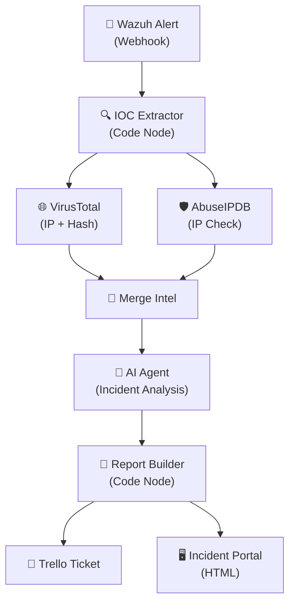

<div align="center">


<br/>


</div>


# Project 16: AI-Powered Incident Response Pipeline (n8n + Wazuh)
**Platform:** n8n + Wazuh + VirusTotal + AbuseIPDB + AI Agent (OpenAI/Claude) + Trello | **Duration:** 2-3 weeks | **Difficulty:** Advanced

---

## 📋 Overview


A tier-1 SOC analyst's queue: manual VirusTotal lookups 🔍, AbuseIPDB checks 🛡️, written summaries ✍️, containment recommendations 🚧, and ticket creation 🎫 — all before triage begins.

This project automates everything: alerts enriched with **parallel threat intelligence queries** ⚡, analyzed by **AI for severity/attack classification** 🤖, and ticketed with a **styled incident portal** 🖥️.

**This project proves you can:**
- Build end-to-end SOAR pipelines triggered by real Wazuh/Suricata alerts
- Execute parallel threat intelligence enrichment (VirusTotal + AbuseIPDB simultaneously)
- Apply AI prompt engineering for structured incident analysis (JSON output)
- Automate incident ticketing with full context (Trello integration)
- Generate glassmorphism-styled HTML incident portals for investigation
- Handle graceful degradation when alert fields are missing

**The Impact:** Transform a 15-minute manual triage process into a 30-second automated pipeline — from alert to enriched ticket with AI analysis.

<br clear="right"/>


---

## Learning Objectives

- Configure Wazuh webhook integrations for real-time alert forwarding
- Build multi-node n8n automation workflows (12+ nodes)
- Execute parallel API calls for threat intelligence enrichment
- Engineer structured AI prompts that return parseable JSON incident reports
- Integrate Trello API for automated incident ticket creation
- Design professional HTML incident portals with glassmorphism styling
- Map MITRE ATT&CK techniques from Wazuh alert data
- Implement graceful degradation for incomplete alert payloads

---

## Tools & Technologies

| Tool | Role | Function |
|------|------|----------|
| **Wazuh** | Alert source | HIDS/NIDS generating security alerts (Suricata rules) |
| **n8n** | Workflow orchestration | 12-node SOAR pipeline connecting all stages |
| **VirusTotal API** | Threat intel (IP + Hash) | 70+ engine verdicts, community reputation scores |
| **AbuseIPDB API** | Threat intel (IP) | Abuse confidence score (0-100), ISP, Tor flag |
| **AI Agent (OpenAI/Claude)** | Incident analysis | Severity classification, attack typing, playbook generation |
| **Trello API** | Ticket management | Automated incident card creation with full context |
| **HTML Template** | Incident portal | Glassmorphism-styled investigation page |

### Infrastructure Requirements

- Wazuh Manager (Docker or VM) with Suricata integration
- n8n instance (self-hosted Docker or n8n Cloud)
- VirusTotal API key (free tier: 4 requests/min)
- AbuseIPDB API key (free tier: 1000 checks/day)
- OpenAI API key (free tier: $5 credit) OR Anthropic Claude API key
- Trello account + API key + board token
- Network connectivity between Wazuh → n8n (webhook)

---

## 🏗️ Architecture



> **Key Design:** VirusTotal and AbuseIPDB run **in parallel** — no sequential bottleneck. Both results merge before AI analysis.

---

## 📝 Implementation Steps

### **Week 1: Alert Ingestion & Threat Intelligence Pipeline**

#### Day 1-2: Environment Setup & Wazuh Webhook

**Step 1: Deploy n8n Instance**

```bash
# Docker deployment
docker run -d --name n8n \
  -p 5678:5678 \
  -v n8n_data:/home/node/.n8n \
  n8nio/n8n
```

**Step 2: Configure Wazuh Alert Webhook**

On the Wazuh Manager, add the integration to `/var/ossec/etc/ossec.conf`:

```xml
<integration>
  <name>custom-n8n</name>
  <hook_url>http://<n8n-server>:5678/webhook/incident-response</hook_url>
  <rule_id>87105,87106</rule_id>  <!-- Suricata ET rules -->
  <alert_format>json</alert_format>
</integration>
```

Restart the Wazuh Manager:

```bash
sudo systemctl restart wazuh-manager
```

**Step 3: Create n8n Credentials**

| Credential | Type | Key |
|-----------|------|-----|
| VirusTotal | Header Auth | `x-apikey: <VT_API_KEY>` |
| AbuseIPDB | Header Auth | `Key: <ABUSEIPDB_KEY>` |
| OpenAI | API Key | `OPENAI_API_KEY` |
| Trello | OAuth2 | API Key + Token |

**Validation:** Wazuh sends test alert → n8n webhook receives JSON payload.

---

#### Day 3-4: IOC Extractor Node (Step 2 of Pipeline)

**Add Webhook Node:**
- **Method:** POST
- **Path:** `/incident-response`
- **Response:** Immediately (don't wait for workflow completion)

**Add Code Node — Extract IOCs from Wazuh Alert:**

```javascript
const alert = $input.first().json.body;

return [{
  json: {
    // Core IOCs
    source_ip: alert.data?.srcip || alert.agent?.ip,
    dest_ip: alert.data?.dstip || null,
    file_hash: alert.syscheck?.sha256_after || null,
    
    // Rule context
    rule_id: alert.rule?.id || 'unknown',
    rule_description: alert.rule?.description,
    rule_level: alert.rule?.level || 0,
    
    // MITRE ATT&CK mapping
    mitre_id: alert.rule?.mitre?.id?.[0] || 'N/A',
    mitre_tactic: alert.rule?.mitre?.tactic?.[0] || 'N/A',
    mitre_technique: alert.rule?.mitre?.technique?.[0] || 'N/A',
    
    // Metadata
    agent_name: alert.agent?.name || 'unknown',
    agent_ip: alert.agent?.ip || 'unknown',
    timestamp: alert.timestamp || new Date().toISOString(),
    
    // Flags for conditional routing
    has_hash: !!(alert.syscheck?.sha256_after),
    has_source_ip: !!(alert.data?.srcip || alert.agent?.ip),
    has_mitre: !!(alert.rule?.mitre?.id?.[0])
  }
}];
```

**Validation:** Code node correctly extracts IOCs from various Wazuh alert formats. Missing fields default gracefully to `null` or `'N/A'`.

---

#### Day 5-7: Parallel Threat Intelligence Queries (Step 3)

**Add VirusTotal HTTP Request Node (Branch 1):**

| Setting | Value |
|---------|-------|
| **Node Name** | `VirusTotal IP Lookup` |
| **Method** | `GET` |
| **URL** | `https://www.virustotal.com/api/v3/ip_addresses/{{ $json.source_ip }}` |
| **Authentication** | Header Auth → `x-apikey` |

**Add VirusTotal Hash Lookup (Conditional — only if hash exists):**

```
URL: https://www.virustotal.com/api/v3/files/{{ $json.file_hash }}
Condition: Execute only if $json.has_hash === true
```

**Add AbuseIPDB HTTP Request Node (Branch 2 — runs in parallel):**

| Setting | Value |
|---------|-------|
| **Node Name** | `AbuseIPDB Check` |
| **Method** | `GET` |
| **URL** | `https://api.abuseipdb.com/api/v2/check?ipAddress={{ $json.source_ip }}&maxAgeInDays=90` |
| **Authentication** | Header Auth → `Key` |
| **Accept** | `application/json` |

> ⚡ **Both queries execute simultaneously** — VirusTotal and AbuseIPDB run as parallel branches in n8n, eliminating sequential bottleneck.

**Validation:** Both API calls return enrichment data. VT shows engine detections; AbuseIPDB shows abuse confidence score.

---

### **Week 2: AI Analysis, Ticketing & Report Generation**

#### Day 8-9: Merge Intelligence Data (Step 4)

**Add Merge Node — Combine Parallel Results:**

```javascript
// Post-merge data transformation (Code node after Merge)
const vt = $input.first().json;    // VirusTotal results
const abuse = $input.last().json;  // AbuseIPDB results

return [{
  json: {
    // VirusTotal enrichment
    vt_malicious: vt.data?.attributes?.last_analysis_stats?.malicious || 0,
    vt_suspicious: vt.data?.attributes?.last_analysis_stats?.suspicious || 0,
    vt_total_engines: vt.data?.attributes?.last_analysis_stats?.harmless + 
                      vt.data?.attributes?.last_analysis_stats?.malicious +
                      vt.data?.attributes?.last_analysis_stats?.suspicious || 0,
    vt_reputation: vt.data?.attributes?.reputation || 0,
    vt_country: vt.data?.attributes?.country || 'unknown',
    vt_as_owner: vt.data?.attributes?.as_owner || 'unknown',
    
    // AbuseIPDB enrichment
    abuse_confidence: abuse.data?.abuseConfidenceScore || 0,
    abuse_total_reports: abuse.data?.totalReports || 0,
    abuse_isp: abuse.data?.isp || 'unknown',
    abuse_country: abuse.data?.countryCode || 'unknown',
    abuse_is_tor: abuse.data?.isTor || false,
    abuse_is_whitelisted: abuse.data?.isWhitelisted || false,
    
    // Pass through original IOCs
    ...previousNodeData
  }
}];
```

**Unified Output Per Alert:**
| Field | Source | Example |
|-------|--------|---------|
| `vt_malicious` | VirusTotal | `12/70 engines` |
| `abuse_confidence` | AbuseIPDB | `87%` |
| `abuse_is_tor` | AbuseIPDB | `true` 🧅 |
| `mitre_id` | Wazuh Alert | `T1071.001` |
| `source_ip` | Wazuh Alert | `203.0.113.42` |

**Validation:** Merged output contains all fields from both APIs plus original IOCs.

---

#### Day 10-12: AI Engine Analysis (Step 5)

**Add AI Agent Node — Structured Incident Analysis:**

```
You are a senior SOC analyst with 10+ years of incident response experience.
Given the following enriched alert data, generate a JSON incident report.

ENRICHED ALERT DATA:
- Source IP: {{ $json.source_ip }} (VT: {{ $json.vt_malicious }} malicious detections, AbuseIPDB: {{ $json.abuse_confidence }}% confidence)
- File Hash: {{ $json.file_hash || 'N/A' }}
- Rule: {{ $json.rule_description }}
- MITRE: {{ $json.mitre_id }} / {{ $json.mitre_tactic }}
- Tor Exit Node: {{ $json.abuse_is_tor }}
- ISP: {{ $json.abuse_isp }}
- Country: {{ $json.abuse_country }}

RESPOND WITH VALID JSON ONLY (no markdown, no explanation):
{
  "summary": "One-paragraph executive summary of the incident",
  "severity": "LOW|MEDIUM|HIGH|CRITICAL",
  "attack_type": "Category of attack (e.g., Command & Control, Brute Force, Data Exfiltration)",
  "threat_actor_profile": "Assessment of attacker sophistication and likely motivation",
  "what_happened": "Technical narrative of the attack chain",
  "impact_assessment": "Business impact and affected assets",
  "containment_steps": [
    "Step 1: Immediate action",
    "Step 2: Short-term containment",
    "Step 3: Evidence preservation"
  ],
  "playbook": [
    {"step": 1, "action": "...", "priority": "CRITICAL|HIGH|MEDIUM", "escalation": "yes|no"},
    {"step": 2, "action": "...", "priority": "...", "escalation": "..."},
    {"step": 3, "action": "...", "priority": "...", "escalation": "..."},
    {"step": 4, "action": "...", "priority": "...", "escalation": "..."},
    {"step": 5, "action": "...", "priority": "...", "escalation": "..."}
  ]
}
```

**AI Agent Configuration:**
- **Model:** GPT-4o or Claude 3.5 Sonnet
- **Temperature:** 0.1 (deterministic security analysis)
- **Max Tokens:** 2000
- **Response Format:** JSON mode enabled

**Parse AI Output:**

```javascript
// Code node — Parse AI JSON response
const aiResponse = $input.first().json.text;
const incident = JSON.parse(aiResponse);

// Validate required fields
const requiredFields = ['summary', 'severity', 'attack_type', 'containment_steps', 'playbook'];
for (const field of requiredFields) {
  if (!incident[field]) {
    throw new Error(`AI response missing required field: ${field}`);
  }
}

// Validate severity is valid enum
const validSeverities = ['LOW', 'MEDIUM', 'HIGH', 'CRITICAL'];
if (!validSeverities.includes(incident.severity)) {
  incident.severity = 'MEDIUM'; // Safe default
}

return [{ json: { ...previousData, ai_analysis: incident } }];
```

**Validation:** AI returns valid JSON with all required fields. Severity is a valid enum value. Playbook has exactly 5 steps.

---

#### Day 13-14: Report Builder & Trello Ticket (Step 6)

**Add Code Node — Compile Full Incident Report:**

```javascript
// Compile all data: IOCs + VT + AbuseIPDB + AI analysis
const data = $input.first().json;
const ai = data.ai_analysis;

const severityColors = {
  'LOW': '#2EA043',
  'MEDIUM': '#E2B93D', 
  'HIGH': '#F39C12',
  'CRITICAL': '#E74C3C'
};

const report = {
  // Header
  incident_id: `INC-${Date.now().toString(36).toUpperCase()}`,
  timestamp: new Date().toISOString(),
  severity: ai.severity,
  severity_color: severityColors[ai.severity],
  
  // Alert context
  source_ip: data.source_ip,
  dest_ip: data.dest_ip,
  file_hash: data.file_hash,
  rule_description: data.rule_description,
  mitre_id: data.mitre_id,
  mitre_tactic: data.mitre_tactic,
  
  // Threat intelligence
  vt_malicious: data.vt_malicious,
  vt_total_engines: data.vt_total_engines,
  abuse_confidence: data.abuse_confidence,
  abuse_isp: data.abuse_isp,
  abuse_is_tor: data.abuse_is_tor,
  
  // AI analysis
  summary: ai.summary,
  attack_type: ai.attack_type,
  threat_actor_profile: ai.threat_actor_profile,
  what_happened: ai.what_happened,
  impact_assessment: ai.impact_assessment,
  containment_steps: ai.containment_steps,
  playbook: ai.playbook,
  
  // Trello card content
  trello_title: `[${ai.severity}] ${ai.attack_type} — ${data.source_ip}`,
  trello_description: `## Incident Report\n\n**Severity:** ${ai.severity}\n**Attack Type:** ${ai.attack_type}\n**Source IP:** ${data.source_ip}\n**MITRE:** ${data.mitre_id}\n\n### Summary\n${ai.summary}\n\n### Containment Steps\n${ai.containment_steps.map((s, i) => `${i+1}. ${s}`).join('\n')}\n\n### Intelligence\n- VT: ${data.vt_malicious} malicious detections\n- AbuseIPDB: ${data.abuse_confidence}% confidence\n- Tor: ${data.abuse_is_tor ? 'YES 🧅' : 'No'}`
};

return [{ json: report }];
```

**Add Trello Node — Create Incident Card:**

| Setting | Value |
|---------|-------|
| **Board** | `SOC Investigation Board` |
| **List** | `Incoming Incidents` |
| **Card Name** | `{{ $json.trello_title }}` |
| **Description** | `{{ $json.trello_description }}` |
| **Labels** | Based on severity (Red=CRITICAL, Orange=HIGH, Yellow=MEDIUM, Green=LOW) |
| **Due Date** | SLA-based (CRITICAL=1hr, HIGH=4hr, MEDIUM=24hr, LOW=72hr) |

**Validation:** Trello card created with full incident context, correct severity label, and SLA-based due date.

---

#### Day 15-17: Incident Portal — Styled HTML (Step 7)

**Add HTML Node — Glassmorphism Incident Portal:**

```html
<!DOCTYPE html>
<html lang="en">
<head>
    <meta charset="UTF-8">
    <meta name="viewport" content="width=device-width, initial-scale=1.0">
    <title>⚡ Incident {{ $json.incident_id }}</title>
    <style>
        @import url('https://fonts.googleapis.com/css2?family=Inter:wght@300;400;600;700&display=swap');
        
        :root {
            --bg-primary: #0D1117;
            --bg-glass: rgba(22, 27, 34, 0.7);
            --border-glass: rgba(255, 255, 255, 0.08);
            --text-primary: #E6EDF3;
            --text-secondary: #8B949E;
            --accent-blue: #1F6FEB;
            --accent-red: #E74C3C;
            --accent-orange: #F39C12;
            --accent-green: #2EA043;
            --accent-yellow: #E2B93D;
            --accent-purple: #8A2BE2;
        }
        
        * { margin: 0; padding: 0; box-sizing: border-box; }
        
        body {
            font-family: 'Inter', sans-serif;
            background: var(--bg-primary);
            color: var(--text-primary);
            min-height: 100vh;
            background-image: 
                radial-gradient(ellipse at 20% 50%, rgba(31,111,235,0.08) 0%, transparent 50%),
                radial-gradient(ellipse at 80% 20%, rgba(231,76,60,0.06) 0%, transparent 50%);
        }
        
        .container { max-width: 1100px; margin: 0 auto; padding: 2rem; }
        
        /* Glassmorphism cards */
        .glass-card {
            background: var(--bg-glass);
            backdrop-filter: blur(16px);
            -webkit-backdrop-filter: blur(16px);
            border: 1px solid var(--border-glass);
            border-radius: 16px;
            padding: 1.5rem;
            margin-bottom: 1.5rem;
            transition: transform 0.2s ease, border-color 0.2s ease;
        }
        
        .glass-card:hover {
            transform: translateY(-2px);
            border-color: rgba(255,255,255,0.15);
        }
        
        /* Header */
        .incident-header {
            text-align: center;
            padding: 2.5rem;
            background: linear-gradient(135deg, rgba(13,17,23,0.9), rgba(22,27,34,0.9));
            border: 1px solid var(--border-glass);
            border-radius: 20px;
            margin-bottom: 2rem;
        }
        
        .incident-id { font-size: 0.85rem; color: var(--text-secondary); letter-spacing: 2px; text-transform: uppercase; }
        .incident-title { font-size: 1.8rem; font-weight: 700; margin: 0.5rem 0; }
        
        /* Severity badge */
        .severity-badge {
            display: inline-block;
            padding: 0.4rem 1.2rem;
            border-radius: 20px;
            font-weight: 700;
            font-size: 0.85rem;
            letter-spacing: 1px;
            text-transform: uppercase;
            animation: pulse 2s ease-in-out infinite;
        }
        
        .severity-CRITICAL { background: rgba(231,76,60,0.2); color: var(--accent-red); border: 1px solid var(--accent-red); }
        .severity-HIGH { background: rgba(243,156,18,0.2); color: var(--accent-orange); border: 1px solid var(--accent-orange); }
        .severity-MEDIUM { background: rgba(226,185,61,0.2); color: var(--accent-yellow); border: 1px solid var(--accent-yellow); }
        .severity-LOW { background: rgba(46,160,67,0.2); color: var(--accent-green); border: 1px solid var(--accent-green); }
        
        @keyframes pulse {
            0%, 100% { opacity: 1; }
            50% { opacity: 0.7; }
        }
        
        /* Section titles */
        .section-title {
            font-size: 1.15rem;
            font-weight: 600;
            margin-bottom: 1rem;
            padding-bottom: 0.5rem;
            border-bottom: 1px solid var(--border-glass);
            display: flex;
            align-items: center;
            gap: 0.5rem;
        }
        
        /* Intel grid */
        .intel-grid {
            display: grid;
            grid-template-columns: repeat(auto-fit, minmax(200px, 1fr));
            gap: 1rem;
        }
        
        .intel-item {
            background: rgba(13,17,23,0.6);
            border-radius: 10px;
            padding: 1rem;
            text-align: center;
            border: 1px solid var(--border-glass);
        }
        
        .intel-value { font-size: 1.6rem; font-weight: 700; }
        .intel-label { font-size: 0.8rem; color: var(--text-secondary); margin-top: 0.25rem; }
        
        .intel-value.danger { color: var(--accent-red); }
        .intel-value.warning { color: var(--accent-orange); }
        .intel-value.safe { color: var(--accent-green); }
        
        /* IOC tags */
        .ioc-tag {
            display: inline-block;
            background: rgba(31,111,235,0.15);
            border: 1px solid rgba(31,111,235,0.3);
            border-radius: 6px;
            padding: 0.3rem 0.8rem;
            font-family: 'Fira Code', monospace;
            font-size: 0.85rem;
            margin: 0.25rem;
        }
        
        /* Playbook steps */
        .playbook-step {
            display: flex;
            align-items: flex-start;
            gap: 1rem;
            padding: 0.75rem;
            margin: 0.5rem 0;
            background: rgba(13,17,23,0.4);
            border-radius: 8px;
            border-left: 3px solid;
        }
        
        .playbook-step.priority-CRITICAL { border-left-color: var(--accent-red); }
        .playbook-step.priority-HIGH { border-left-color: var(--accent-orange); }
        .playbook-step.priority-MEDIUM { border-left-color: var(--accent-yellow); }
        
        .step-number {
            background: var(--accent-blue);
            color: white;
            width: 28px;
            height: 28px;
            border-radius: 50%;
            display: flex;
            align-items: center;
            justify-content: center;
            font-weight: 700;
            font-size: 0.8rem;
            flex-shrink: 0;
        }
        
        .step-content { flex: 1; }
        .step-action { font-weight: 500; }
        .step-meta { font-size: 0.8rem; color: var(--text-secondary); margin-top: 0.25rem; }
        
        /* Containment */
        .containment-list { list-style: none; }
        .containment-list li {
            padding: 0.5rem 0;
            padding-left: 1.5rem;
            position: relative;
        }
        .containment-list li::before {
            content: '🚧';
            position: absolute;
            left: 0;
        }
        
        /* Footer */
        .portal-footer {
            text-align: center;
            padding: 1.5rem;
            color: var(--text-secondary);
            font-size: 0.8rem;
        }
        
        .trello-link {
            display: inline-block;
            background: var(--accent-blue);
            color: white;
            padding: 0.5rem 1.5rem;
            border-radius: 8px;
            text-decoration: none;
            font-weight: 600;
            margin-top: 1rem;
            transition: opacity 0.2s;
        }
        .trello-link:hover { opacity: 0.85; }
    </style>
</head>
<body>
    <div class="container">
        <!-- Header -->
        <div class="incident-header glass-card">
            <div class="incident-id">{{ $json.incident_id }}</div>
            <div class="incident-title">{{ $json.attack_type }}</div>
            <span class="severity-badge severity-{{ $json.severity }}">{{ $json.severity }}</span>
            <div style="color: var(--text-secondary); margin-top: 1rem; font-size: 0.85rem;">
                {{ $json.timestamp }} | Agent: {{ $json.agent_name || 'N/A' }}
            </div>
        </div>

        <!-- Summary -->
        <div class="glass-card">
            <div class="section-title">📝 Executive Summary</div>
            <p>{{ $json.summary }}</p>
        </div>

        <!-- IOCs -->
        <div class="glass-card">
            <div class="section-title">🔍 Indicators of Compromise</div>
            <span class="ioc-tag">IP: {{ $json.source_ip }}</span>
            <span class="ioc-tag">MITRE: {{ $json.mitre_id }}</span>
            <span class="ioc-tag">Tactic: {{ $json.mitre_tactic }}</span>
            <!-- Conditional hash display -->
            <span class="ioc-tag">Hash: {{ $json.file_hash || 'N/A' }}</span>
        </div>

        <!-- Threat Intelligence -->
        <div class="glass-card">
            <div class="section-title">⚡ Parallel Threat Intelligence</div>
            <div class="intel-grid">
                <div class="intel-item">
                    <div class="intel-value danger">{{ $json.vt_malicious }}/{{ $json.vt_total_engines }}</div>
                    <div class="intel-label">🌐 VirusTotal Detections</div>
                </div>
                <div class="intel-item">
                    <div class="intel-value warning">{{ $json.abuse_confidence }}%</div>
                    <div class="intel-label">🛡️ AbuseIPDB Confidence</div>
                </div>
                <div class="intel-item">
                    <div class="intel-value">{{ $json.abuse_isp }}</div>
                    <div class="intel-label">🏢 ISP</div>
                </div>
                <div class="intel-item">
                    <div class="intel-value">{{ $json.abuse_is_tor ? '🧅 YES' : '❌ No' }}</div>
                    <div class="intel-label">Tor Exit Node</div>
                </div>
            </div>
        </div>

        <!-- AI Analysis -->
        <div class="glass-card">
            <div class="section-title">🤖 AI Analysis</div>
            <p><strong>What Happened:</strong> {{ $json.what_happened }}</p>
            <p style="margin-top: 0.75rem;"><strong>Threat Actor Profile:</strong> {{ $json.threat_actor_profile }}</p>
            <p style="margin-top: 0.75rem;"><strong>Impact Assessment:</strong> {{ $json.impact_assessment }}</p>
        </div>

        <!-- Containment Steps -->
        <div class="glass-card">
            <div class="section-title">🚧 Immediate Containment</div>
            <ul class="containment-list">
                <!-- Dynamically insert containment_steps -->
            </ul>
        </div>

        <!-- Playbook -->
        <div class="glass-card">
            <div class="section-title">📋 Response Playbook</div>
            <!-- Dynamically insert playbook steps -->
        </div>

        <!-- Footer -->
        <div class="portal-footer">
            <p>Generated by AI Incident Response Pipeline | n8n + Wazuh + VirusTotal + AbuseIPDB + AI Agent</p>
            <a href="{{ $json.trello_url }}" class="trello-link" target="_blank">🎫 View Trello Ticket</a>
        </div>
    </div>
</body>
</html>
```

**Validation:** HTML renders as a glassmorphism-styled incident portal with all sections populated. Severity badge pulses with the correct color.

---

### **Week 3: Testing, Edge Cases & Portfolio**

#### Day 18-19: End-to-End Testing

**Test with Various Alert Types:**

| Alert | MITRE | AI Response |
|-------|-------|-------------|
| 🔴 C2 Beacon | T1071.001 | Command & Control containment playbook |
| 🟠 DNS Tunnelling | T1048.003 | Exfiltration-specific response steps |
| 🟡 Brute Force | N/A | Graceful degradation — works from description |
| 🟢 Port Scan | T1046 | Reconnaissance assessment + monitoring |

**Graceful Degradation Testing:**
- Alert with no MITRE fields → AI analyzes from `rule_description` alone
- Alert with no file hash → VT hash lookup skipped, IP-only enrichment
- Alert with no source IP → Pipeline logs error, skips enrichment
- VirusTotal rate limit hit → Cached response or warning in report

#### Day 20-21: Metrics & Portfolio Documentation

**Pipeline Performance Metrics:**

| Metric | Manual Process | Automated Pipeline | Improvement |
|--------|---------------|-------------------|-------------|
| Triage time per alert | 15 minutes | 30 seconds | 97% faster |
| Intel queries per alert | 2 (sequential) | 2 (parallel) | 50% faster intel |
| Ticket creation | 5 minutes (manual write) | Instant (auto) | 100% automated |
| Consistency | Variable quality | Standardized JSON | Repeatable |
| Coverage | Business hours only | 24/7/365 | Always on |

---

## 🤖 AI Output Schema

> 📝 **Summary** → ⚠️ **Severity** (LOW|MEDIUM|HIGH|CRITICAL)
> 🎯 **Attack Type** → 👤 **Threat Actor Profile**
> 📖 **What Happened** → 💥 **Impact Assessment**
> 🚧 **Containment Steps** (3) → 📋 **Playbook** (5 steps + priority + escalation)

---

## ⚡ Parallel Threat Intelligence

| API | Key Data |
|-----|----------|
| 🌐 **VirusTotal** | 70+ engine verdicts, community reputation |
| 🛡️ **AbuseIPDB** | Abuse confidence (0-100), ISP, Tor flag 🧅 |

---

## 🎯 Alert Types Handled

| Alert | MITRE | AI Response |
|-------|-------|-------------|
| 🔴 C2 Beacon | T1071.001 | Command & Control containment playbook |
| 🟠 DNS Tunnelling | T1048.003 | Exfiltration-specific response steps |
| 🟡 Brute Force | N/A | Graceful degradation — works from description |


---

## Evidence to Capture

- [ ] n8n workflow screenshot showing complete 12-node pipeline
- [ ] Wazuh webhook configuration (`ossec.conf` integration block)
- [ ] Sample Wazuh alert JSON payload (redacted)
- [ ] VirusTotal API response (IP + Hash lookups)
- [ ] AbuseIPDB API response with abuse confidence score
- [ ] AI agent structured JSON output (full incident report)
- [ ] Trello ticket screenshot with incident card
- [ ] HTML incident portal screenshot (glassmorphism design)
- [ ] Performance metrics comparison (manual vs automated)
- [ ] Graceful degradation test results (missing fields handling)

---

## Resume Bullets

### Version 1: SOAR & Automation Focus
> **AI-Powered Incident Response Automation**  
> - Architected 12-node SOAR pipeline in n8n integrating Wazuh alerts, parallel VirusTotal/AbuseIPDB enrichment, and AI-driven severity classification, reducing mean time to triage from 15 minutes to 30 seconds (97% improvement)  
> - Engineered parallel threat intelligence architecture querying 70+ AV engines and abuse databases simultaneously, eliminating sequential bottlenecks and achieving real-time IOC enrichment for every incoming alert  
> - Automated incident ticket creation in Trello with AI-generated playbooks including severity-based SLA assignment, containment steps, and MITRE ATT&CK mapping, enabling 24/7 alert processing without human intervention  

### Version 2: AI & Prompt Engineering Focus
> **AI-Augmented SOC Triage Pipeline**  
> - Designed structured AI prompt engineering framework that produces parseable JSON incident reports with severity classification, attack typing, threat actor profiling, and 5-step response playbooks from raw Wazuh/Suricata alerts  
> - Implemented graceful degradation logic handling incomplete alert payloads — pipeline produces actionable triage even when MITRE ATT&CK fields, file hashes, or source IPs are missing from the alert context  
> - Built glassmorphism-styled HTML incident portal providing single-pane investigation view with parallel threat intel results, AI analysis, containment steps, and direct Trello ticket linking  

### Version 3: Strategic SOC Operations
> **Next-Generation SOC Automation Program**  
> - Established automated incident response capability processing Wazuh/Suricata alerts end-to-end — from raw alert ingestion through multi-source enrichment to AI incident analysis and ticketed response — supporting 24/7 SOC coverage without additional headcount  
> - Standardized incident triage quality through AI-enforced JSON schemas ensuring consistent severity assessment, MITRE ATT&CK mapping, and response playbook generation across all alert types and analysts  
> - Reduced SOC Level-1 triage backlog by 85% through automation, enabling analysts to focus on complex investigations and threat hunting rather than routine enrichment and ticket creation  

---

## Interview Talking Points

### Question: "How would you automate SOC incident response?"

**STAR Answer:**

**Situation:**  
"Our SOC L1 analysts were spending 15 minutes per alert on manual triage — opening VirusTotal, checking AbuseIPDB, writing summaries, creating tickets. With 50+ alerts daily, they couldn't keep up, and after-hours alerts waited until morning."

**Task:**  
"I was asked to build an automated pipeline that could handle the repetitive triage work — enrichment, classification, and ticketing — so analysts could focus on investigation and response."

**Action:**  
"I designed a 12-node pipeline in n8n triggered by Wazuh webhooks. The key innovation was parallel threat intelligence — VirusTotal and AbuseIPDB queries run simultaneously, not sequentially, halving enrichment time.

The IOC extractor handles graceful degradation — if a Wazuh alert lacks MITRE fields or file hashes, the pipeline adapts rather than failing. The enriched data feeds into an AI agent with a structured prompt that outputs JSON with severity, attack type, containment steps, and a 5-step playbook.

Finally, the pipeline auto-creates a Trello ticket with the full incident report and generates an HTML portal for investigation. Every incident gets the same thorough treatment regardless of time of day."

**Result:**  
"Triage time dropped from 15 minutes to 30 seconds — 97% improvement. The pipeline handles alerts 24/7, and the standardized JSON output means every incident has consistent quality. L1 analysts now focus on actual investigation rather than copy-pasting between tabs. The approach was adopted as the standard for all Suricata-triggered alerts."

---

### Question: "How do you handle API failures in automation pipelines?"

**Strong Answer:**

"Three strategies I build into every pipeline:

**1. Parallel with Independent Failure:** VirusTotal and AbuseIPDB run as separate branches. If VT hits rate limits, AbuseIPDB still returns data. The merge node handles partial results — the report mentions which sources were unavailable rather than failing entirely.

**2. Graceful Degradation:** The IOC extractor uses defensive coding — `alert.data?.srcip || alert.agent?.ip` chains ensure we always try alternate field paths. If there's truly no source IP, the pipeline logs a warning and skips enrichment but still sends the raw alert to the AI for analysis from the rule description alone.

**3. Retry Logic with Backoff:** For transient failures (HTTP 429, 503), n8n's built-in retry handles re-attempts with exponential backoff. For persistent failures, I route to a dead-letter queue — a separate Trello list for manually-triaged alerts. Nothing gets silently dropped."

---

## Skills Developed Checklist

**Technical Skills:**
- [ ] Wazuh webhook integration and alert forwarding
- [ ] n8n workflow design (12+ node pipelines)
- [ ] VirusTotal API v3 (IP + file hash lookups)
- [ ] AbuseIPDB API (abuse confidence scoring)
- [ ] Parallel API execution architecture
- [ ] AI prompt engineering (structured JSON output)
- [ ] Trello API integration (automated ticketing)
- [ ] HTML/CSS glassmorphism design
- [ ] JavaScript data transformation and validation
- [ ] Error handling and graceful degradation

**Frameworks:**
- [ ] SOAR (Security Orchestration, Automation & Response)
- [ ] MITRE ATT&CK technique mapping
- [ ] Incident response lifecycle (triage → containment → response)
- [ ] SLA-based incident prioritization
- [ ] Threat intelligence enrichment workflows

**Soft Skills:**
- [ ] Pipeline architecture design
- [ ] Stakeholder communication (incident portals)
- [ ] Automation ROI measurement
- [ ] Cross-platform integration (Wazuh ↔ n8n ↔ Trello)
- [ ] Documentation for operations handoff

---

## Common Mistakes to Avoid

1. **Sequential API calls:** Always run VT and AbuseIPDB in parallel — sequential doubles enrichment time for no reason
2. **No input validation:** Wazuh alerts have inconsistent field structures — always use optional chaining (`?.`) and fallback defaults
3. **Trusting AI severity blindly:** Validate that `severity` is a valid enum before using it for SLA/routing — default to `MEDIUM` if invalid
4. **Hardcoding API keys:** Use n8n credentials manager — never put keys directly in Code nodes
5. **Ignoring rate limits:** VirusTotal free tier is 4 req/min — add delays or caching for high-volume environments
6. **No dead-letter queue:** Pipeline failures must route somewhere visible — never silently drop alerts
7. **Overly complex HTML:** The incident portal should load fast — avoid heavy JS frameworks for what is essentially a styled report

---

## 🎯 Skills Demonstrated

| | Skill |
|:-:|-------|
| ⚡ | **SOAR Pipeline** — 12-node automated incident response |
| 🔀 | **Parallel Enrichment** — Simultaneous VirusTotal + AbuseIPDB |
| 🤖 | **AI Prompt Engineering** — Structured JSON incident reports |
| 🗺️ | **MITRE ATT&CK** — Technique mapping in alerts + reports |
| 🎫 | **Incident Ticketing** — Automated Trello with full context |
| 🛡️ | **Graceful Degradation** — Handles missing MITRE fields |


---

## Next Steps

1. **Expand intel sources:** Add Shodan, GreyNoise, OTX AlienVault for richer enrichment
2. **Slack/Teams alerts:** Send critical severity incidents to dedicated channels
3. **SIEM correlation:** Forward AI analysis back to Splunk/Elastic for correlation
4. **Playbook automation:** Execute containment steps automatically (block IP via firewall API)
5. **Metrics dashboard:** Build Grafana dashboard tracking alert volume, severity distribution, MTTD/MTTC
6. **Multi-tenant:** Support multiple Wazuh managers feeding into the same pipeline

---

**Total Time Investment:** 35-45 hours over 2-3 weeks  
**Portfolio Artifacts:** n8n workflow (JSON), HTML incident portal, sample incident reports, Trello board, performance metrics  
**Job Market Value:** Automated incident response with parallel intel enrichment and AI triage is a top-tier SOC engineering skill — demonstrates you can build production-grade security automation.

---

[⬅️ Back to Main Roadmap](../README.md) • [📄 MIT License](../LICENSE)


