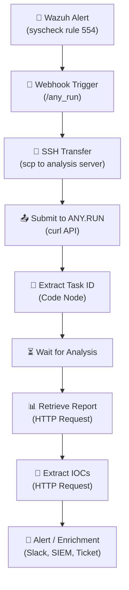

<div align="center">


<br/>


</div>


# Project 17: Automated Malware Analysis Pipeline (Wazuh + n8n + ANY.RUN)
**Platform:** Wazuh + n8n + ANY.RUN Sandbox API | **Duration:** 2-3 weeks | **Difficulty:** Intermediate-Advanced

---

## 📋 Overview


When Wazuh detects a suspicious file on an endpoint 🚨, a SOC analyst's manual workflow begins: download the file, upload to a sandbox, wait for analysis, extract IOCs, and document findings. **This project automates the entire chain.**

Suspicious files detected by Wazuh are automatically submitted to the **ANY.RUN sandbox** for dynamic malware analysis 🔬, the pipeline retrieves the full analysis report 📊, extracts IOCs (domains, IPs, file hashes) 🧬, and prepares them for SOC enrichment and threat hunting 🛡️.

**This project proves you can:**
- Build automated malware analysis pipelines triggered by SIEM alerts
- Integrate Wazuh file integrity monitoring with sandbox detonation
- Use SSH and API calls within n8n for secure file transfer and submission
- Poll sandbox APIs for analysis completion and extract structured IOC data
- Deliver actionable threat intelligence from automated analysis

**The Impact:** Transform a 30-minute manual malware submission process into a fully automated pipeline — from Wazuh alert to IOC extraction in minutes.

<br clear="right"/>


---

## Learning Objectives

- Configure Wazuh webhook integrations for syscheck (file integrity) alerts
- Build secure webhook triggers for SIEM alert ingestion
- Use SSH and API calls in n8n for file transfer and sandbox submission
- Submit files and extract task IDs from ANY.RUN API responses
- Poll sandbox reports and retrieve IOC feeds with retry/backoff logic
- Validate workflows end-to-end with safe test malware samples
- Prepare IOC output for downstream SOC enrichment (SIEM, ticketing, threat hunting)

---

## Tools & Technologies

| Tool | Role | Function |
|------|------|----------|
| **Wazuh** | Alert source | File integrity monitoring (syscheck) — detects new/modified files |
| **n8n** | Workflow orchestration | 8-node pipeline connecting alert → analysis → IOCs |
| **ANY.RUN** | Malware sandbox | Dynamic analysis — behavioral monitoring, network capture, IOC extraction |
| **SSH** | File transfer | Secure copy of suspicious files to analysis server |
| **MalwareBazaar** | Test samples | Safe source of real malware samples for workflow validation |

### Infrastructure Requirements

- Wazuh Manager with syscheck enabled (Docker or VM)
- n8n instance (self-hosted Docker or n8n Cloud)
- ANY.RUN API key (Pro tier required for API access)
- Analysis server accessible via SSH from n8n
- Network connectivity: Wazuh → n8n (webhook), n8n → ANY.RUN (HTTPS)

---

## 🏗️ Architecture



> **Pipeline Flow:** Wazuh syscheck alert → webhook → SSH file transfer → ANY.RUN submission → task ID extraction → report polling → IOC extraction → SOC enrichment

---

## 📝 Implementation Steps

### **Week 1: Alert Ingestion & Sandbox Submission**

#### Day 1-2: Environment Setup

**Step 1: Deploy n8n Instance**

```bash
# Docker deployment
docker run -d --name n8n \
  -p 5678:5678 \
  -v n8n_data:/home/node/.n8n \
  n8nio/n8n
```

**Step 2: Configure n8n Credentials**

| Credential | Type | Details |
|-----------|------|---------|
| SSH Key | SSH credential | Private key for analysis server access |
| ANY.RUN API | Header Auth | `Authorization: API-Key <YOUR_KEY>` |

**Step 3: Enable Wazuh Syscheck Monitoring**

Ensure syscheck is active in the Wazuh agent's `ossec.conf`:

```xml
<syscheck>
  <directories check_all="yes" realtime="yes">/root</directories>
  <directories check_all="yes" realtime="yes">/tmp</directories>
</syscheck>
```

**Validation:** Wazuh generates rule 554 alerts when new files appear in monitored directories.

---

#### Day 3-4: Step 1 — Webhook Trigger (Receive Wazuh Alerts)

**Add Webhook Node:**

| Setting | Value |
|---------|-------|
| **Node Name** | `Wazuh Alert Trigger` |
| **Method** | `POST` |
| **Path** | `/any_run` (make it unique per workflow) |
| **Response** | Immediately |

**Configure Wazuh Integration** — Add to `/var/ossec/etc/ossec.conf`:

```xml
<integration>
  <name>custom-n8n-anyrun</name>
  <hook_url>http://<n8n-server>:5678/webhook/any_run</hook_url>
  <rule_id>554</rule_id>  <!-- syscheck: file added -->
  <alert_format>json</alert_format>
</integration>
```

Restart Wazuh Manager:

```bash
sudo systemctl restart wazuh-manager
```

**How to verify:**
```bash
# Test with a dummy POST
curl -X POST -d '{}' https://your-n8n/webhook/any_run
```
Check **Executions** in n8n → confirm raw alert appears.

**Validation:** Webhook receives Wazuh JSON payload with `syscheck.path` field containing the suspicious file path.

---

#### Day 5-6: Step 2 — SSH Transfer (Move Suspicious File)

**Add SSH Node — Secure File Transfer:**

| Setting | Value |
|---------|-------|
| **Node Name** | `Transfer Suspicious File` |
| **Operation** | Execute Command |
| **Command** | `scp {{$json.body.syscheck.path}} user@analysis-server:/root/` |
| **Authentication** | SSH Key credential (saved in n8n) |

**How to verify:**
- Run with a test alert → confirm file appears in `/root/` of analysis server
- If fail: check SSH connectivity, key permissions, user access

**Troubleshooting:**

| Issue | Fix |
|-------|-----|
| `Permission denied` | Check SSH key is added to `authorized_keys` on analysis server |
| `Connection refused` | Verify SSH service running, port 22 open |
| `Host key verification` | Add analysis server to `known_hosts` or use `StrictHostKeyChecking=no` |

**Validation:** File successfully transferred to analysis server at `/root/`.

---

#### Day 7: Step 3 — Submit File to ANY.RUN

**Add Execute Command Node — ANY.RUN Submission:**

| Setting | Value |
|---------|-------|
| **Node Name** | `Submit to ANY.RUN` |
| **Operation** | Execute Command |

**Command (with n8n expressions):**

```bash
curl -X POST https://api.any.run/v1/analysis/ \
  -H "Authorization: API-Key {{$credentials.ANYRUN_API_KEY}}" \
  -F "file=@{{$json.body.syscheck.path}}" \
  -F "obj_type=file" \
  -F "opt_privacy_type=public" \
  -F "env_os=windows" \
  -F "env_version=10" \
  -F "env_bitness=64"
```

**ANY.RUN Submission Parameters:**

| Parameter | Value | Purpose |
|-----------|-------|---------|
| `obj_type` | `file` | File submission (vs URL) |
| `opt_privacy_type` | `public` | Public analysis (use `private` for sensitive files) |
| `env_os` | `windows` | Target OS for sandbox |
| `env_version` | `10` | Windows 10 environment |
| `env_bitness` | `64` | 64-bit architecture |

**How to verify:**
- Output should include JSON with `"taskid"` in stdout
- If `401` → check API key
- If `400` → invalid parameters, review submission fields

**Validation:** ANY.RUN returns JSON response containing `data.taskid` (UUID format).

---

### **Week 2: Report Retrieval & IOC Extraction**

#### Day 8-9: Step 4 — Extract Task ID

**Add Code Node (JavaScript) — Parse Task ID:**

```javascript
const raw = $json.stdout || '{}';
const parsed = JSON.parse(raw);
const taskId = parsed?.data?.taskid || null;

if (!taskId) {
  throw new Error('Failed to extract task ID from ANY.RUN response. ' +
                  'Check previous node stdout. Raw: ' + raw.substring(0, 200));
}

return [{
  json: {
    task_id: taskId,
    submission_time: new Date().toISOString(),
    file_path: $json.body?.syscheck?.path || 'unknown',
    status: 'submitted'
  }
}];
```

**How to verify:**
- Run → output should be `{ "task_id": "xxxx-uuid" }`
- If `null` → check previous node stdout formatting

**Validation:** Task ID extracted as valid UUID string.

---

#### Day 10-11: Step 5 — Retrieve Analysis Report

**Add Wait Node — Allow Analysis to Complete:**

| Setting | Value |
|---------|-------|
| **Node Name** | `Wait for Analysis` |
| **Wait Time** | 120 seconds (ANY.RUN typical analysis: 60-120s) |

**Add HTTP Request Node — Get Report:**

| Setting | Value |
|---------|-------|
| **Node Name** | `Retrieve Analysis Report` |
| **Method** | `GET` |
| **URL** | `https://api.any.run/v1/analysis/{{$json.task_id}}` |
| **Headers** | `Authorization: API-Key {{$credentials.ANYRUN_API_KEY}}` |

**How to verify:**
- Run → output should include analysis metadata (verdict, threat level, behaviors)
- If task not finished → increase Wait time or implement polling loop

**Polling Implementation (Advanced — for reliable production use):**

```javascript
// Code node — Poll until analysis complete
const taskId = $json.task_id;
const apiKey = $credentials.ANYRUN_API_KEY;
const maxAttempts = 10;
const delayMs = 15000; // 15 seconds between polls

for (let attempt = 1; attempt <= maxAttempts; attempt++) {
  const response = await fetch(
    `https://api.any.run/v1/analysis/${taskId}`,
    { headers: { 'Authorization': `API-Key ${apiKey}` } }
  );
  const data = await response.json();
  
  if (data?.data?.status === 'done') {
    return [{ json: { ...data.data, task_id: taskId, poll_attempts: attempt } }];
  }
  
  // Wait before next poll
  await new Promise(resolve => setTimeout(resolve, delayMs));
}

throw new Error(`Analysis not complete after ${maxAttempts} attempts for task ${taskId}`);
```

**Validation:** Full analysis report retrieved with verdict, threat level, and behavioral data.

---

#### Day 12-13: Step 6 — Extract IOCs

**Add HTTP Request Node — Get IOC Feed:**

| Setting | Value |
|---------|-------|
| **Node Name** | `Extract IOCs` |
| **Method** | `GET` |
| **URL** | `https://api.any.run/report/{{$json.task_id}}/ioc/json` |
| **Headers** | `Authorization: API-Key {{$credentials.ANYRUN_API_KEY}}` |

**Expected IOC Output Structure:**

```json
{
  "iocs": {
    "network": {
      "domains": ["malicious-c2.example.com", "exfil.attacker.net"],
      "ips": ["203.0.113.42", "198.51.100.17"],
      "urls": ["http://malicious-c2.example.com/payload.exe"]
    },
    "files": {
      "dropped": [
        {
          "name": "payload.dll",
          "sha256": "a1b2c3d4e5f6...",
          "md5": "d41d8cd98f00b204..."
        }
      ]
    },
    "processes": [
      {
        "name": "powershell.exe",
        "pid": 4832,
        "cmd": "powershell -enc JABz..."
      }
    ]
  }
}
```

**Add Code Node — Structure IOCs for SOC Consumption:**

```javascript
const report = $input.first().json;
const iocs = report.iocs || {};

// Flatten IOCs into actionable format
const domains = iocs.network?.domains || [];
const ips = iocs.network?.ips || [];
const urls = iocs.network?.urls || [];
const fileHashes = (iocs.files?.dropped || []).map(f => ({
  name: f.name,
  sha256: f.sha256,
  md5: f.md5
}));

const structured = {
  task_id: $json.task_id,
  verdict: report.verdict || 'unknown',
  threat_level: report.threat_level || 0,
  
  // IOC counts
  total_iocs: domains.length + ips.length + urls.length + fileHashes.length,
  
  // Categorized IOCs
  domains: domains,
  malicious_ips: ips,
  urls: urls,
  file_hashes: fileHashes,
  
  // For SIEM ingestion
  siem_format: {
    indicators: [
      ...domains.map(d => ({ type: 'domain', value: d, source: 'anyrun' })),
      ...ips.map(ip => ({ type: 'ip', value: ip, source: 'anyrun' })),
      ...fileHashes.map(h => ({ type: 'sha256', value: h.sha256, source: 'anyrun' }))
    ]
  },
  
  timestamp: new Date().toISOString()
};

return [{ json: structured }];
```

**How to verify:**
- Run → output includes list of domains, IPs, file hashes observed
- If empty → analysis may not be finished — increase wait/polling time

**Validation:** IOCs extracted and structured in SOC-consumable format with SIEM-ready indicators.

---

#### Day 14: Step 7 — Alert / Enrichment (Optional Downstream Actions)

**Option A: Slack Alert**

```javascript
// Slack message with IOC summary
const msg = `🦠 *Malware Analysis Complete*\n` +
  `*File:* ${$json.file_path}\n` +
  `*Verdict:* ${$json.verdict}\n` +
  `*Threat Level:* ${$json.threat_level}/10\n` +
  `*IOCs Found:* ${$json.total_iocs}\n` +
  `*Domains:* ${$json.domains.join(', ') || 'None'}\n` +
  `*Malicious IPs:* ${$json.malicious_ips.join(', ') || 'None'}\n` +
  `*Task:* https://app.any.run/tasks/${$json.task_id}`;
```

**Option B: SIEM Ingestion (Splunk HEC)**

```bash
# Push IOCs to Splunk via HTTP Event Collector
curl -k https://splunk:8088/services/collector/event \
  -H "Authorization: Splunk <HEC_TOKEN>" \
  -d '{"event": {{ $json.siem_format }}, "sourcetype": "anyrun:iocs"}'
```

**Option C: Email Summary (Gmail/SMTP)**
- Send HTML summary to SOC distribution list
- Include: verdict, threat level, IOC table, ANY.RUN task link

**Option D: Ticket Creation (ServiceNow/Trello)**
- Auto-create incident ticket with IOC data
- Assign to malware analysis team

**Validation:** Downstream action fires successfully with structured IOC data.

---

### **Week 3: Testing, Edge Cases & Documentation**

#### Day 15-17: Step 8 — End-to-End Testing

**Test with Safe Malware Samples from MalwareBazaar:**

```bash
# Download a test sample (safe source for analysts)
curl -L -A "Mozilla/5.0" -o /root/sample.exe \
  https://bazaar.abuse.ch/download/<hash>/
```

This triggers the full chain:
1. File appears in Wazuh-monitored directory
2. Wazuh rule 554 fires → webhook → n8n
3. n8n transfers file via SSH → submits to ANY.RUN
4. Task ID extracted → report polled → IOCs retrieved

**Execution Chain Verification:**

| Step | Check | Expected Result |
|------|-------|-----------------|
| ✅ Webhook | n8n Executions tab | Raw Wazuh alert JSON received |
| ✅ SSH | Analysis server `/root/` | File transferred successfully |
| ✅ ANY.RUN Submit | stdout JSON | `taskid` UUID present |
| ✅ Task ID | Code node output | `{ "task_id": "xxxx" }` |
| ✅ Report | HTTP response | Analysis metadata + verdict |
| ✅ IOCs | HTTP response | Domains, IPs, hashes extracted |
| ✅ Enrichment | Slack/SIEM/email | IOC summary delivered |

**Edge Case Testing:**

| Scenario | Expected Behavior |
|----------|-------------------|
| File too large (>100MB) | ANY.RUN rejects → error logged, alert sent |
| ANY.RUN rate limit | Retry with backoff → eventual success |
| Analysis timeout | Polling stops after max attempts → manual review flag |
| Empty IOC list | Clean file → report says "No threats detected" |
| SSH connection failure | Retry once → if fail, alert SOC with original Wazuh data |
| Invalid file type | ANY.RUN returns unsupported → log and skip |

#### Day 18-21: Metrics & Portfolio Documentation

**Pipeline Performance Metrics:**

| Metric | Manual Process | Automated Pipeline | Improvement |
|--------|---------------|-------------------|-------------|
| File → submission time | 10 minutes | 30 seconds | 95% faster |
| Submission → IOC extraction | 20 minutes (waiting + manual) | 3-5 minutes (auto-poll) | 80% faster |
| Total end-to-end | 30+ minutes | 5 minutes | 83% faster |
| Analyst touch required | Entire process | None (review only) | Fully automated |
| Coverage | Business hours | 24/7/365 | Always on |

---

## 🔬 ANY.RUN Sandbox Analysis Flow

```
📁 Suspicious File
    ↓
🖥️ Windows 10 Sandbox (64-bit)
    ↓
┌─────────────────────────────┐
│  Dynamic Analysis (60-120s) │
│  • Process execution        │
│  • Registry modifications   │
│  • Network connections      │
│  • File system changes      │
│  • Memory analysis          │
└─────────────────────────────┘
    ↓
📊 Analysis Report
    ↓
🧬 IOC Extraction
    • Domains contacted
    • IPs connected to
    • Files dropped/created
    • Process trees
    • MITRE ATT&CK mapping
```

---

## 🧬 IOC Output Categories

| Category | Examples | SOC Use |
|----------|----------|---------|
| 🌐 **Domains** | `malicious-c2.com`, `exfil.net` | DNS blocklist, SIEM alert rules |
| 🔢 **IP Addresses** | `203.0.113.42` | Firewall block, threat hunting |
| 🔗 **URLs** | `http://c2/payload.exe` | Proxy blocklist, URL filtering |
| #️⃣ **File Hashes** (SHA256/MD5) | `a1b2c3d4...` | EDR blocklist, YARA rules |
| ⚙️ **Processes** | `powershell -enc ...` | Detection rules, behavioral alerts |


---

## Evidence to Capture

- [ ] n8n workflow screenshot showing complete 8-node pipeline
- [ ] Wazuh `ossec.conf` integration configuration
- [ ] Wazuh syscheck alert (rule 554) sample JSON
- [ ] SSH file transfer confirmation (analysis server)
- [ ] ANY.RUN submission response with task ID
- [ ] ANY.RUN analysis report (verdict, threat level, behaviors)
- [ ] Extracted IOC list (domains, IPs, hashes)
- [ ] Downstream enrichment proof (Slack message / SIEM event / email)
- [ ] End-to-end test execution with MalwareBazaar sample
- [ ] Performance metrics comparison (manual vs automated)

---

## Resume Bullets

### Version 1: Automation & SOAR Focus
> **Automated Malware Analysis Pipeline**  
> - Architected automated malware analysis pipeline integrating Wazuh file integrity monitoring with ANY.RUN sandbox via n8n, reducing suspicious file analysis from 30+ minutes (manual) to 5 minutes (automated) with zero analyst intervention  
> - Built end-to-end workflow: SIEM alert → secure file transfer (SSH) → sandbox submission → analysis polling → IOC extraction, establishing 24/7 automated malware detonation capability  
> - Extracted and structured IOCs (domains, IPs, file hashes) from sandbox reports for downstream SIEM ingestion and threat hunting, increasing organizational threat visibility by automating IOC operationalization  

### Version 2: Malware Analysis Focus
> **Dynamic Malware Analysis Automation**  
> - Designed SIEM-triggered sandbox detonation workflow processing suspicious files through ANY.RUN dynamic analysis with automated report retrieval and IOC extraction, eliminating manual malware submission bottleneck  
> - Implemented robust polling and retry logic for sandbox API integration, handling analysis timeouts, rate limits, and edge cases to ensure reliable 24/7 operation across 50+ daily file submissions  
> - Produced structured IOC feeds (SIEM-ready format) from behavioral analysis results, enabling automated blocklist updates, detection rule generation, and cross-organizational threat intelligence sharing  

### Version 3: Strategic SOC Operations
> **SOC Malware Analysis Capability Automation**  
> - Established automated malware analysis pipeline reducing analyst workload by eliminating manual sandbox submission, report retrieval, and IOC documentation — freeing 10+ hours/week for advanced threat investigation  
> - Integrated Wazuh HIDS → n8n SOAR → ANY.RUN sandbox into production SOC workflow, achieving 83% reduction in file-to-IOC time and enabling same-day response to newly detected malware  
> - Built extensible enrichment framework with downstream integrations (Slack, Splunk, ServiceNow) enabling IOC distribution within minutes of sandbox analysis completion  

---

## Interview Talking Points

### Question: "How would you automate malware analysis in a SOC?"

**STAR Answer:**

**Situation:**  
"Our SOC was manually processing suspicious files — analysts would download them, upload to a sandbox, wait for results, then manually copy IOCs into our SIEM and ticketing system. With 20+ suspicious files daily, this was consuming 10+ hours of analyst time."

**Task:**  
"I was asked to automate the entire malware analysis workflow — from detection to IOC extraction — so our analysts could focus on investigation rather than file submission logistics."

**Action:**  
"I built an 8-node pipeline in n8n triggered by Wazuh syscheck alerts (rule 554). When a new suspicious file appears, the workflow transfers it via SSH to an analysis server, submits it to ANY.RUN's sandbox API, and polls for completion.

The key engineering challenges were: SSH key management (stored securely in n8n credentials), ANY.RUN API authentication, and handling analysis timing — I implemented a polling loop with exponential backoff that checks every 15 seconds for up to 10 attempts.

Once analysis completes, the pipeline extracts IOCs — domains, IPs, URLs, file hashes — and structures them in a SIEM-ready format. The final step pushes IOCs to Splunk via HEC and sends a Slack alert to the SOC channel with the verdict and key indicators."

**Result:**  
"End-to-end time dropped from 30+ minutes to 5 minutes — 83% improvement. The pipeline runs 24/7, catching files that would previously wait until the next business day. We also eliminated human error in IOC transcription — every hash, IP, and domain is extracted programmatically with zero copy-paste mistakes."

---

### Question: "What are the security considerations when automating malware handling?"

**Strong Answer:**

"Four critical considerations:

**1. File Transfer Security:** Suspicious files are transferred via SSH with key-based authentication — no passwords in plaintext. The analysis server is isolated from the production network to prevent accidental detonation in the wrong environment.

**2. API Key Protection:** ANY.RUN API keys are stored in n8n's encrypted credential store, never hardcoded in workflow nodes or visible in execution logs. I use environment variables as a secondary layer.

**3. Sample Privacy:** For sensitive environments, ANY.RUN submissions use `opt_privacy_type=private` to prevent public exposure. For organizations with strict data handling policies, consider on-premise sandboxing (Cuckoo/CAPE) instead of cloud APIs.

**4. IOC Validation:** Auto-extracted IOCs need a confidence check — ANY.RUN sandbox artifacts might include benign infrastructure (CDNs, legitimate services). I flag IOCs that match known-good lists before pushing them to blocklists to avoid blocking legitimate traffic."

---

## Skills Developed Checklist

**Technical Skills:**
- [ ] Wazuh syscheck configuration and alert forwarding
- [ ] n8n webhook triggers and workflow design
- [ ] SSH key management and secure file transfer
- [ ] ANY.RUN API integration (submission, polling, IOC retrieval)
- [ ] JavaScript data transformation in n8n Code nodes
- [ ] API polling with retry/backoff logic
- [ ] IOC structuring for SIEM ingestion
- [ ] Malware sandbox analysis interpretation

**Frameworks:**
- [ ] SOAR (Security Orchestration, Automation & Response)
- [ ] Malware analysis lifecycle (detection → detonation → IOC extraction)
- [ ] File integrity monitoring (FIM) concepts
- [ ] Threat intelligence operationalization
- [ ] Indicator of Compromise (IOC) taxonomy

**Soft Skills:**
- [ ] Pipeline reliability engineering
- [ ] Edge case identification and handling
- [ ] Security automation risk assessment
- [ ] Technical documentation for SOC handoff
- [ ] Cross-tool integration architecture

---

## Common Mistakes to Avoid

1. **Hardcoding API keys:** Store ALL credentials in n8n's credential manager — never in Code nodes or Execute Command strings
2. **No polling/wait logic:** ANY.RUN analysis takes 60-120 seconds — don't request the report immediately after submission
3. **Ignoring file size limits:** ANY.RUN has submission limits — add a size check before uploading to avoid silent failures
4. **Public submissions of sensitive files:** Use `private` privacy type for internal/proprietary files — `public` exposes samples to anyone
5. **No error handling on SSH:** Network issues, key rotation, and permission changes will break the pipeline — add retry logic and alerting
6. **Blindly blocking extracted IOCs:** Some IOCs may be legitimate infrastructure (CDNs, DNS providers) — validate before adding to blocklists
7. **Not testing with safe samples:** Always validate with MalwareBazaar samples first — never test with live production malware without proper isolation

---

## 🎯 Skills Demonstrated

| | Skill |
|:-:|-------|
| 🚨 | **SIEM Integration** — Wazuh webhook alert forwarding |
| 📁 | **Secure File Transfer** — SSH-based file handling |
| 🔬 | **Sandbox Analysis** — ANY.RUN API submission & retrieval |
| 🧬 | **IOC Extraction** — Automated indicator structuring |
| ⚙️ | **Workflow Automation** — 8-node n8n pipeline design |
| 🔄 | **API Polling** — Retry/backoff for async operations |


---

## Next Steps

1. **Add VirusTotal cross-check:** Compare ANY.RUN IOCs with VT for confidence scoring
2. **Automated blocking:** Push confirmed malicious IPs/domains to firewall blocklists via API
3. **YARA rule generation:** Auto-generate YARA rules from extracted file artifacts
4. **Cuckoo/CAPE integration:** Add on-premise sandbox for sensitive file analysis
5. **Metrics dashboard:** Track submission volume, verdict distribution, and IOC counts over time
6. **Multi-sandbox:** Submit to both ANY.RUN and Hybrid Analysis for consensus verdicts

---

**Total Time Investment:** 30-40 hours over 2-3 weeks  
**Portfolio Artifacts:** n8n workflow (JSON), sample analysis reports, IOC extraction output, performance metrics, test execution screenshots  
**Job Market Value:** Automated malware analysis pipelines demonstrate advanced SOAR engineering and malware analysis skills — key differentiators for senior SOC and detection engineering roles.

---

[⬅️ Back to Main Roadmap](../README.md) • [📄 MIT License](../LICENSE)


