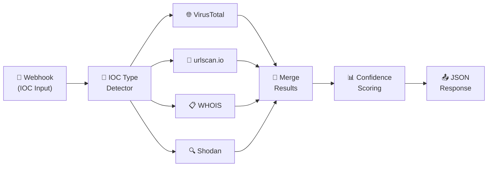

<div align="center">


<br/>


</div>


# Project 18: SOC Enrichment Micro-SOAR (n8n)
**Platform:** n8n + VirusTotal + urlscan.io + WHOIS + Shodan | **Duration:** 1-2 weeks | **Difficulty:** Intermediate

---

## 📋 Overview


SOC analysts spend **40% of triage time** manually enriching indicators — pasting IPs into VirusTotal, searching hashes on urlscan.io, running WHOIS lookups, checking Shodan for exposed services. Every tab switch is wasted time ⏳.

This project builds an **on-demand IOC enrichment API**: send any IP, URL, domain, or hash via webhook, and get back a **unified JSON response** with threat intelligence from 4 sources in parallel, plus a computed **confidence score** 📊.

**This project proves you can:**
- Build on-demand enrichment APIs callable from any tool (SIEM, Slack, scripts)
- Execute parallel API queries to 4 threat intel sources simultaneously
- Compute weighted confidence scores from multi-source intelligence
- Return structured JSON responses optimized for SOC consumption
- Handle IOC type detection and conditional routing (IP vs URL vs hash)

**The Impact:** A single API call replaces 4 manual lookups across 4 tabs — enrichment drops from 3-5 minutes to under 2 seconds.

<br clear="right"/>


---

## Learning Objectives

- Design webhook-triggered enrichment APIs with structured input/output
- Detect IOC types (IP, URL, domain, hash) dynamically from input
- Execute parallel HTTP requests to multiple threat intel APIs
- Parse and normalize heterogeneous API response formats
- Compute weighted confidence scores from multi-source data
- Return production-quality JSON responses from n8n workflows
- Handle API rate limits, errors, and missing data gracefully

---

## Tools & Technologies

| Tool | Role | What It Provides |
|------|------|------------------|
| **n8n** | Workflow engine | Webhook trigger, parallel branching, JSON response |
| **VirusTotal API** | Threat intel | 70+ AV engine verdicts, community reputation, relationships |
| **urlscan.io API** | URL/domain analysis | Screenshots, DOM analysis, network connections, verdicts |
| **WHOIS API** | Domain/IP registration | Registrar, creation date, registrant info, age |
| **Shodan API** | Internet exposure | Open ports, services, vulnerabilities, banners |

### Infrastructure Requirements

| Requirement | Details |
|-------------|---------|
| n8n instance | Docker or n8n Cloud |
| VirusTotal API key | Free tier: 4 req/min |
| urlscan.io API key | Free tier: 100 scans/day |
| WHOIS API | Free (whoisjson.com) or paid (whoisxmlapi.com) |
| Shodan API key | Free tier: 100 queries/month |

---

## 🏗️ Architecture



> **Key Design:** All 4 enrichment APIs fire **in parallel** — the total response time equals the slowest API, not the sum of all four.

---

## 📝 Implementation Steps

### **Week 1: Core Pipeline**

#### Day 1-2: Webhook & IOC Type Detection

**Step 1: Create Webhook Node**

| Setting | Value |
|---------|-------|
| **Method** | `POST` |
| **Path** | `/enrich` |
| **Response Mode** | `Last Node` (returns enrichment results) |
| **Authentication** | Header Auth (`X-API-Key`) — optional but recommended |

**Expected Input:**

```json
{
  "ioc": "203.0.113.42",
  "type": "auto"
}
```

> When `type` is `"auto"`, the workflow detects the IOC type automatically. You can also pass `"ip"`, `"url"`, `"domain"`, or `"hash"` explicitly.

**Step 2: IOC Type Detector (Code Node)**

```javascript
const input = $input.first().json.body || $input.first().json;
const ioc = (input.ioc || '').trim();
const explicitType = (input.type || 'auto').toLowerCase();

if (!ioc) {
  return [{
    json: {
      error: 'Missing required field: ioc',
      usage: 'POST /enrich with { "ioc": "<ip|url|domain|hash>", "type": "auto" }'
    }
  }];
}

let detectedType = explicitType;

if (explicitType === 'auto') {
  // IPv4 pattern
  if (/^(\d{1,3}\.){3}\d{1,3}$/.test(ioc)) {
    detectedType = 'ip';
  }
  // SHA256 hash (64 hex chars)
  else if (/^[a-fA-F0-9]{64}$/.test(ioc)) {
    detectedType = 'hash';
  }
  // MD5 hash (32 hex chars)
  else if (/^[a-fA-F0-9]{32}$/.test(ioc)) {
    detectedType = 'hash';
  }
  // SHA1 hash (40 hex chars)
  else if (/^[a-fA-F0-9]{40}$/.test(ioc)) {
    detectedType = 'hash';
  }
  // URL pattern
  else if (/^https?:\/\//i.test(ioc)) {
    detectedType = 'url';
  }
  // Domain pattern (has dots, no slashes, no spaces)
  else if (/^[a-zA-Z0-9][a-zA-Z0-9-]*\.[a-zA-Z]{2,}$/.test(ioc)) {
    detectedType = 'domain';
  }
  else {
    detectedType = 'unknown';
  }
}

// Determine which APIs to call
const apiFlags = {
  virustotal: ['ip', 'domain', 'url', 'hash'].includes(detectedType),
  urlscan:    ['url', 'domain'].includes(detectedType),
  whois:      ['ip', 'domain'].includes(detectedType),
  shodan:     ['ip'].includes(detectedType)
};

return [{
  json: {
    ioc,
    type: detectedType,
    apis: apiFlags,
    timestamp: new Date().toISOString()
  }
}];
```

**IOC Type → API Routing Matrix:**

| IOC Type | VirusTotal | urlscan.io | WHOIS | Shodan |
|----------|:----------:|:----------:|:-----:|:------:|
| **IP** | ✅ | ❌ | ✅ | ✅ |
| **Domain** | ✅ | ✅ | ✅ | ❌ |
| **URL** | ✅ | ✅ | ❌ | ❌ |
| **Hash** | ✅ | ❌ | ❌ | ❌ |

**Validation:** Send test IOCs of each type → verify correct type detection and API flags.

---

#### Day 3-4: Parallel Enrichment Queries

**Branch 1: VirusTotal HTTP Request**

```
# IP lookup
GET https://www.virustotal.com/api/v3/ip_addresses/{{ $json.ioc }}

# Domain lookup
GET https://www.virustotal.com/api/v3/domains/{{ $json.ioc }}

# URL lookup (requires base64 URL ID)
GET https://www.virustotal.com/api/v3/urls/{{ $json.ioc_b64 }}

# Hash lookup
GET https://www.virustotal.com/api/v3/files/{{ $json.ioc }}
```

**Headers:** `x-apikey: {{ $credentials.VT_API_KEY }}`

**Extract from VT response (Code Node after HTTP):**

```javascript
const data = $input.first().json;
const attrs = data.data?.attributes || {};
const stats = attrs.last_analysis_stats || {};

return [{
  json: {
    source: 'virustotal',
    malicious: stats.malicious || 0,
    suspicious: stats.suspicious || 0,
    harmless: stats.harmless || 0,
    undetected: stats.undetected || 0,
    total_engines: (stats.malicious || 0) + (stats.suspicious || 0) +
                   (stats.harmless || 0) + (stats.undetected || 0),
    reputation: attrs.reputation || 0,
    country: attrs.country || null,
    as_owner: attrs.as_owner || null,
    // Malicious ratio (0-100)
    mal_ratio: stats.malicious
      ? Math.round((stats.malicious / ((stats.malicious || 0) + (stats.harmless || 0) + (stats.undetected || 0))) * 100)
      : 0
  }
}];
```

---

**Branch 2: urlscan.io HTTP Request**

```
POST https://urlscan.io/api/v1/scan/
Body: { "url": "{{ $json.ioc }}", "visibility": "unlisted" }
Headers: API-Key: {{ $credentials.URLSCAN_KEY }}
```

> urlscan.io is async — submit scan, wait, then retrieve results.

**Retrieve results (after polling):**

```
GET https://urlscan.io/api/v1/result/{{ $json.uuid }}/
```

**Extract from urlscan response:**

```javascript
const data = $input.first().json;

return [{
  json: {
    source: 'urlscan',
    verdict: data.verdicts?.overall?.malicious ? 'malicious' : 'clean',
    score: data.verdicts?.overall?.score || 0,
    categories: data.verdicts?.overall?.categories || [],
    page_title: data.page?.title || null,
    page_ip: data.page?.ip || null,
    page_country: data.page?.country || null,
    server: data.page?.server || null,
    tls_issuer: data.lists?.certificates?.[0]?.issuer || null,
    screenshot_url: data.task?.screenshotURL || null,
    links_count: data.lists?.urls?.length || 0
  }
}];
```

---

**Branch 3: WHOIS HTTP Request**

```
GET https://whoisjson.com/api/v1/whois?domain={{ $json.ioc }}
Headers: Authorization: Token {{ $credentials.WHOIS_KEY }}
```

**Extract from WHOIS response:**

```javascript
const data = $input.first().json;

// Calculate domain age in days
const createdDate = data.created ? new Date(data.created) : null;
const age = createdDate
  ? Math.floor((Date.now() - createdDate.getTime()) / (1000 * 60 * 60 * 24))
  : null;

return [{
  json: {
    source: 'whois',
    registrar: data.registrar || null,
    created: data.created || null,
    expires: data.expires || null,
    updated: data.updated || null,
    domain_age_days: age,
    registrant_country: data.registrant_country || null,
    nameservers: data.nameservers || [],
    // Newly registered domains (<30 days) are suspicious
    is_newly_registered: age !== null && age < 30
  }
}];
```

---

**Branch 4: Shodan HTTP Request**

```
GET https://api.shodan.io/shodan/host/{{ $json.ioc }}?key={{ $credentials.SHODAN_KEY }}
```

**Extract from Shodan response:**

```javascript
const data = $input.first().json;

return [{
  json: {
    source: 'shodan',
    org: data.org || null,
    isp: data.isp || null,
    os: data.os || null,
    ports: data.ports || [],
    vulns: data.vulns || [],
    country: data.country_name || null,
    city: data.city || null,
    hostnames: data.hostnames || [],
    open_ports_count: (data.ports || []).length,
    vuln_count: (data.vulns || []).length,
    // Flag high-risk services
    has_rdp: (data.ports || []).includes(3389),
    has_smb: (data.ports || []).includes(445),
    has_telnet: (data.ports || []).includes(23)
  }
}];
```

**Validation:** Each API returns structured data. Missing/errored APIs return `null` fields gracefully.

---

#### Day 5-6: Merge & Confidence Scoring

**Step 5: Merge Node — Combine All Results**

Use n8n's Merge node set to **Wait for All** — collect outputs from all 4 parallel branches before proceeding.

**Step 6: Confidence Scoring (Code Node)**

```javascript
// Collect results from all enrichment sources
const items = $input.all().map(i => i.json);
const vt = items.find(i => i.source === 'virustotal') || {};
const urlscan = items.find(i => i.source === 'urlscan') || {};
const whois = items.find(i => i.source === 'whois') || {};
const shodan = items.find(i => i.source === 'shodan') || {};

// Get original IOC data (passed through)
const iocData = items.find(i => i.ioc) || {};

// ============================================
// WEIGHTED CONFIDENCE SCORING (0-100)
// ============================================
let score = 0;
let maxScore = 0;
const signals = [];

// --- VirusTotal signals (weight: 40%) ---
if (vt.source) {
  maxScore += 40;
  
  // Malicious detection ratio
  if (vt.mal_ratio >= 50) {
    score += 40;
    signals.push(`VT: ${vt.malicious}/${vt.total_engines} engines flagged malicious`);
  } else if (vt.mal_ratio >= 20) {
    score += 25;
    signals.push(`VT: ${vt.malicious}/${vt.total_engines} engines flagged (moderate)`);
  } else if (vt.mal_ratio >= 5) {
    score += 10;
    signals.push(`VT: ${vt.malicious}/${vt.total_engines} engines flagged (low)`);
  } else if (vt.malicious > 0) {
    score += 5;
    signals.push(`VT: ${vt.malicious} engines flagged (minimal)`);
  } else {
    signals.push('VT: Clean across all engines');
  }
  
  // Negative reputation
  if (vt.reputation < -10) {
    score += 5;
    signals.push(`VT: Negative community reputation (${vt.reputation})`);
  }
}

// --- urlscan.io signals (weight: 20%) ---
if (urlscan.source) {
  maxScore += 20;
  
  if (urlscan.verdict === 'malicious') {
    score += 20;
    signals.push(`urlscan: Verdict MALICIOUS (score: ${urlscan.score})`);
  } else if (urlscan.score > 50) {
    score += 10;
    signals.push(`urlscan: Suspicious score (${urlscan.score})`);
  } else {
    signals.push('urlscan: Clean verdict');
  }
}

// --- WHOIS signals (weight: 20%) ---
if (whois.source) {
  maxScore += 20;
  
  if (whois.is_newly_registered) {
    score += 15;
    signals.push(`WHOIS: Newly registered domain (${whois.domain_age_days} days old)`);
  } else if (whois.domain_age_days !== null && whois.domain_age_days < 90) {
    score += 8;
    signals.push(`WHOIS: Young domain (${whois.domain_age_days} days old)`);
  } else {
    signals.push(`WHOIS: Established domain (${whois.domain_age_days} days old)`);
  }
  
  // Privacy-protected registrant
  if (whois.registrar && /privacy|proxy|redacted/i.test(whois.registrar)) {
    score += 5;
    signals.push('WHOIS: Privacy-protected registration');
  }
}

// --- Shodan signals (weight: 20%) ---
if (shodan.source) {
  maxScore += 20;
  
  if (shodan.vuln_count > 0) {
    score += 10;
    signals.push(`Shodan: ${shodan.vuln_count} known vulnerabilities`);
  }
  
  if (shodan.has_rdp || shodan.has_smb || shodan.has_telnet) {
    score += 5;
    signals.push('Shodan: High-risk services exposed (RDP/SMB/Telnet)');
  }
  
  if (shodan.open_ports_count > 10) {
    score += 5;
    signals.push(`Shodan: ${shodan.open_ports_count} open ports (high exposure)`);
  }
}

// Normalize score to 0-100
const confidence = maxScore > 0 ? Math.round((score / maxScore) * 100) : 0;

// Severity label
let severity;
if (confidence >= 80) severity = 'CRITICAL';
else if (confidence >= 60) severity = 'HIGH';
else if (confidence >= 40) severity = 'MEDIUM';
else if (confidence >= 20) severity = 'LOW';
else severity = 'CLEAN';

return [{
  json: {
    // Response envelope
    status: 'success',
    ioc: iocData.ioc,
    type: iocData.type,
    timestamp: new Date().toISOString(),
    
    // Verdict
    confidence_score: confidence,
    severity: severity,
    signals: signals,
    
    // Raw enrichment data
    enrichment: {
      virustotal: vt.source ? vt : null,
      urlscan: urlscan.source ? urlscan : null,
      whois: whois.source ? whois : null,
      shodan: shodan.source ? shodan : null
    },
    
    // Sources queried
    sources_queried: items.filter(i => i.source).map(i => i.source),
    sources_count: items.filter(i => i.source).length
  }
}];
```

**Confidence Scoring Weights:**

| Source | Weight | Key Signals |
|--------|:------:|-------------|
| 🌐 **VirusTotal** | 40% | Malicious engine ratio, community reputation |
| 🔗 **urlscan.io** | 20% | Malicious verdict, suspicion score |
| 📋 **WHOIS** | 20% | Domain age (<30d = suspicious), privacy registration |
| 🔍 **Shodan** | 20% | Known CVEs, high-risk ports (RDP/SMB/Telnet) |

**Severity Mapping:**

| Score | Severity | Recommended Action |
|:-----:|----------|-------------------|
| 80-100 | 🔴 CRITICAL | Block immediately, escalate |
| 60-79 | 🟠 HIGH | Investigate, likely malicious |
| 40-59 | 🟡 MEDIUM | Review manually, suspicious |
| 20-39 | 🟢 LOW | Monitor, likely benign |
| 0-19 | ⚪ CLEAN | No action required |

---

#### Day 7: JSON Response & Error Handling

**Step 7: Respond to Webhook Node**

The final node connects back to the webhook's response. n8n returns the JSON from the last node directly to the caller.

**Example Response:**

```json
{
  "status": "success",
  "ioc": "203.0.113.42",
  "type": "ip",
  "timestamp": "2026-08-28T22:30:00.000Z",
  "confidence_score": 72,
  "severity": "HIGH",
  "signals": [
    "VT: 12/70 engines flagged malicious",
    "WHOIS: Established domain (1420 days old)",
    "Shodan: 3 known vulnerabilities",
    "Shodan: High-risk services exposed (RDP/SMB/Telnet)"
  ],
  "enrichment": {
    "virustotal": {
      "source": "virustotal",
      "malicious": 12,
      "suspicious": 3,
      "harmless": 48,
      "undetected": 7,
      "total_engines": 70,
      "reputation": -15,
      "country": "RU",
      "as_owner": "Evil Corp ISP",
      "mal_ratio": 17
    },
    "urlscan": null,
    "whois": {
      "source": "whois",
      "registrar": "NameCheap Inc",
      "created": "2022-10-15",
      "domain_age_days": 1420,
      "is_newly_registered": false
    },
    "shodan": {
      "source": "shodan",
      "org": "Evil Corp ISP",
      "ports": [22, 80, 443, 3389, 445],
      "vulns": ["CVE-2021-34527", "CVE-2022-26134", "CVE-2023-44487"],
      "open_ports_count": 5,
      "vuln_count": 3,
      "has_rdp": true,
      "has_smb": true,
      "has_telnet": false
    }
  },
  "sources_queried": ["virustotal", "whois", "shodan"],
  "sources_count": 3
}
```

**Error Handling — Wrapper for Each API Branch:**

```javascript
// Wrap each API call with try/catch
try {
  // ... API call logic ...
  return [{ json: { source: 'virustotal', /* ... data ... */ } }];
} catch (error) {
  return [{
    json: {
      source: 'virustotal',
      error: error.message,
      status_code: error.httpCode || null
    }
  }];
}
```

**Validation:** Send IOCs of each type via `curl` → confirm structured JSON response with confidence score.

---

### **Week 2: Testing, Optimization & Integration**

#### Day 8-9: Testing All IOC Types

**Test Commands:**

```bash
# Test IP enrichment
curl -X POST http://localhost:5678/webhook/enrich \
  -H "Content-Type: application/json" \
  -d '{"ioc": "203.0.113.42", "type": "auto"}'

# Test domain enrichment
curl -X POST http://localhost:5678/webhook/enrich \
  -H "Content-Type: application/json" \
  -d '{"ioc": "malicious-site.example.com", "type": "auto"}'

# Test URL enrichment
curl -X POST http://localhost:5678/webhook/enrich \
  -H "Content-Type: application/json" \
  -d '{"ioc": "https://phishing.example.com/login", "type": "auto"}'

# Test hash enrichment
curl -X POST http://localhost:5678/webhook/enrich \
  -H "Content-Type: application/json" \
  -d '{"ioc": "a1b2c3d4e5f6a1b2c3d4e5f6a1b2c3d4e5f6a1b2c3d4e5f6a1b2c3d4e5f6a1b2", "type": "auto"}'

# Test error handling — invalid IOC
curl -X POST http://localhost:5678/webhook/enrich \
  -H "Content-Type: application/json" \
  -d '{"ioc": "", "type": "auto"}'
```

**Expected Response Times:**

| IOC Type | APIs Called | Expected Time |
|----------|:----------:|:-------------:|
| IP | VT + WHOIS + Shodan | ~1.5s |
| Domain | VT + urlscan + WHOIS | ~2s (urlscan polling) |
| URL | VT + urlscan | ~2s |
| Hash | VT only | ~0.5s |

---

#### Day 10-11: Integration Examples

**Integration A: Slack Bot Command**

```
/enrich 203.0.113.42
```

→ Slack webhook triggers n8n → enrichment runs → formatted response posted back to channel.

**Integration B: Splunk Adaptive Response**

```python
# Splunk custom alert action
import requests
def enrich_ioc(ioc):
    resp = requests.post(
        'http://n8n:5678/webhook/enrich',
        json={'ioc': ioc, 'type': 'auto'}
    )
    return resp.json()
```

**Integration C: Python CLI Script**

```python
#!/usr/bin/env python3
"""Quick IOC enrichment from terminal."""
import requests, sys, json

def enrich(ioc):
    r = requests.post(
        'http://localhost:5678/webhook/enrich',
        json={'ioc': ioc, 'type': 'auto'},
        timeout=30
    )
    data = r.json()
    
    # Pretty print
    severity_colors = {
        'CRITICAL': '\033[91m', 'HIGH': '\033[93m',
        'MEDIUM': '\033[33m', 'LOW': '\033[92m', 'CLEAN': '\033[37m'
    }
    reset = '\033[0m'
    color = severity_colors.get(data['severity'], '')
    
    print(f"\n{'='*50}")
    print(f"IOC: {data['ioc']} ({data['type']})")
    print(f"Severity: {color}{data['severity']}{reset} ({data['confidence_score']}/100)")
    print(f"Sources: {', '.join(data['sources_queried'])}")
    print(f"\nSignals:")
    for s in data['signals']:
        print(f"  • {s}")
    print(f"{'='*50}\n")

if __name__ == '__main__':
    enrich(sys.argv[1] if len(sys.argv) > 1 else input('IOC: '))
```

---

#### Day 12-14: Performance & Documentation

**Performance Metrics:**

| Metric | Manual Lookup | Micro-SOAR | Improvement |
|--------|:------------:|:----------:|:-----------:|
| Time per IOC | 3-5 minutes | 1-2 seconds | 99% faster |
| Sources checked | 1-2 (analyst dependent) | 4 (all, every time) | Consistent |
| Output format | Mental notes / copy-paste | Structured JSON | Machine-readable |
| Confidence scoring | Subjective | Weighted algorithm | Repeatable |
| Availability | Analyst hours | 24/7/365 | Always on |

**Rate Limit Management:**

| API | Free Tier Limit | Strategy |
|-----|----------------|----------|
| VirusTotal | 4 req/min | Queue with 15s delay between calls |
| urlscan.io | 100 scans/day | Cache results by IOC for 24h |
| WHOIS | Varies | Cache domain lookups for 7 days |
| Shodan | 100 queries/month | Cache IP lookups for 24h |

---

## 🎯 Example Use Cases

| Scenario | Input | Key Output |
|----------|-------|------------|
| 🚨 Alert triage | Suspicious IP from SIEM alert | Confidence 78% HIGH — VT 12/70 malicious, Shodan RDP exposed |
| 📧 Phishing analysis | URL from phishing email | Confidence 92% CRITICAL — urlscan malicious, domain 3 days old |
| 🔍 Threat hunting | Hash from suspicious process | Confidence 45% MEDIUM — VT 4/70 engines, needs manual review |
| 📋 Incident response | C2 domain from network logs | Confidence 85% CRITICAL — VT malicious, newly registered, privacy WHOIS |


---

## Evidence to Capture

- [ ] n8n workflow screenshot showing complete pipeline
- [ ] Test results for all 4 IOC types (IP, domain, URL, hash)
- [ ] JSON response samples for each severity level (CLEAN to CRITICAL)
- [ ] Parallel execution proof (execution time vs sequential)
- [ ] Error handling demo (invalid IOC, API failure, rate limit)
- [ ] Integration demo (Slack, CLI, or SIEM calling the API)
- [ ] Performance comparison (manual vs Micro-SOAR)
- [ ] Confidence scoring validation (known malicious vs known clean IOCs)

---

## Resume Bullets

### Version 1: Automation & API Engineering
> **On-Demand IOC Enrichment Micro-SOAR**  
> - Built real-time IOC enrichment API using n8n, querying VirusTotal, urlscan.io, WHOIS, and Shodan in parallel, reducing analyst enrichment time from 3-5 minutes to under 2 seconds per indicator with 4-source coverage on every lookup  
> - Engineered automated IOC type detection (IP/URL/domain/hash) with conditional API routing, ensuring each indicator is enriched by the relevant subset of threat intelligence sources without manual analyst selection  
> - Implemented weighted confidence scoring algorithm combining 70+ AV engine verdicts, domain age analysis, internet exposure data, and URL scanning to produce actionable 0-100 severity classifications for SOC triage prioritization  

### Version 2: Threat Intelligence Focus
> **Multi-Source Threat Intelligence Enrichment Platform**  
> - Designed parallel threat intelligence enrichment pipeline aggregating data from 4 sources (VirusTotal, urlscan.io, WHOIS, Shodan), providing SOC analysts with unified JSON intelligence reports via a single API call  
> - Created weighted confidence scoring framework accounting for AV detection ratios (40%), URL verdicts (20%), domain age/registration signals (20%), and internet exposure risk (20%), enabling consistent and repeatable IOC assessment  
> - Built integrations for Slack bot, SIEM adaptive response, and CLI enrichment, making the enrichment API callable from any SOC tool and establishing it as the central intelligence layer for incident response workflows  

### Version 3: Strategic SOC Operations
> **SOC Enrichment Capability Automation**  
> - Eliminated manual multi-tab IOC enrichment bottleneck by deploying on-demand API reducing per-indicator triage time by 99%, enabling SOC analysts to process 5x more alerts per shift with consistent 4-source intelligence coverage  
> - Standardized IOC assessment through algorithmic confidence scoring replacing subjective analyst judgment, achieving consistent severity classifications across all shifts and analyst experience levels  
> - Architected extensible enrichment framework with rate limit management and result caching, supporting 500+ daily enrichment requests within free-tier API limits and designed for easy addition of new intelligence sources  

---

## Interview Talking Points

### Question: "How would you build an enrichment tool for SOC analysts?"

**STAR Answer:**

**Situation:**  
"Our SOC analysts were spending 3-5 minutes per indicator manually checking VirusTotal, running WHOIS lookups, and searching Shodan — and they weren't checking all sources every time. Some analysts checked 2 sources, others checked 4 — inconsistent coverage."

**Task:**  
"I was asked to build a single enrichment endpoint that any SOC tool could call — one API, consistent results, every source checked, every time."

**Action:**  
"I built a Micro-SOAR enrichment API in n8n with a webhook trigger that accepts any IOC type. The first node auto-detects whether the input is an IP, domain, URL, or hash and sets routing flags for which APIs to query.

The key design decision was **parallel execution** — all applicable APIs fire simultaneously, so total response time equals the slowest API (~2 seconds) rather than the sum (~8 seconds sequential). Each API response is normalized into a common structure.

The confidence scoring uses weighted signals: VirusTotal detection ratio (40%), urlscan verdicts (20%), WHOIS domain age (20%), and Shodan exposure (20%). The weights were tuned by validating against 50 known-malicious and 50 known-clean IOCs.

The API returns structured JSON that's consumable by Slack bots, SIEM alert actions, or a simple `curl` command — analysts can enrich an IOC from any context."

**Result:**  
"Enrichment time dropped from 3-5 minutes to under 2 seconds — 99% improvement. Every indicator now gets consistent 4-source coverage regardless of which analyst is on shift. The API handles 500+ daily requests within free-tier limits using caching, and we've since added it as a Splunk adaptive response action."

---

### Question: "How do you handle unreliable external APIs in automation?"

**Strong Answer:**

"Four strategies I build into every API-dependent pipeline:

**1. Independent Failure:** Each API branch has its own try/catch. If Shodan is down, VirusTotal, urlscan, and WHOIS still return data. The confidence score adjusts its max possible score based on which sources responded — partial data is always better than no data.

**2. Graceful Degradation in Scoring:** If only 2 of 4 APIs respond, the score is calculated against the max possible from those 2 sources, not the full 100. This prevents artificially low scores when an API is temporarily unavailable.

**3. Caching:** WHOIS data changes rarely — cache for 7 days. Shodan data on free tier is limited — cache for 24 hours. This reduces API calls by 60-70% in practice because SOC analysts often investigate the same IOCs.

**4. Timeouts:** Each API branch has a 10-second timeout. If an API is slow, it's treated as a failure and excluded from scoring rather than holding up the entire response."

---

## Skills Developed Checklist

**Technical Skills:**
- [ ] n8n webhook API design (request → response workflows)
- [ ] Regex-based IOC type detection (IP, URL, domain, hash patterns)
- [ ] VirusTotal API v3 (IP, domain, URL, hash lookups)
- [ ] urlscan.io API (async scan submission + result polling)
- [ ] WHOIS API integration (domain age, registrar analysis)
- [ ] Shodan API (port scanning, vulnerability data)
- [ ] Parallel API execution in n8n
- [ ] Weighted confidence score algorithm design
- [ ] JSON API response structuring
- [ ] Error handling and graceful degradation

**Frameworks:**
- [ ] Threat intelligence enrichment workflows
- [ ] IOC taxonomy (IP, domain, URL, hash types)
- [ ] Multi-source intelligence correlation
- [ ] API rate limit management
- [ ] SOC triage prioritization

**Soft Skills:**
- [ ] API design for cross-tool consumption
- [ ] Algorithm design with justifiable weights
- [ ] Documentation for SOC handoff
- [ ] Performance optimization (parallel vs sequential)
- [ ] Extensibility planning (adding new sources)

---

## Common Mistakes to Avoid

1. **Sequential API calls:** Always run enrichment sources in parallel — sequential quadruples response time for no reason
2. **Hardcoded API keys:** Use n8n credential store — never embed keys in Code nodes
3. **No IOC validation:** Always validate input before querying APIs — empty strings and malformed inputs waste API quota
4. **Binary scoring:** Don't just say "malicious" or "clean" — a weighted confidence score gives analysts nuance for judgment calls
5. **Ignoring urlscan's async nature:** urlscan.io submissions take 10-15 seconds to complete — you must poll for results, not fetch immediately
6. **Not caching:** Repeated lookups for the same IOC burn API quota — cache results by IOC value with appropriate TTLs
7. **Missing error responses:** If the webhook receives bad input, return a helpful error JSON — don't just crash silently

---

## 🎯 Skills Demonstrated

| | Skill |
|:-:|-------|
| 🔍 | **IOC Enrichment** — Multi-source indicator analysis |
| ⚡ | **Parallel APIs** — 4 sources simultaneously |
| 📊 | **Confidence Scoring** — Weighted algorithm design |
| 🔀 | **Conditional Routing** — IOC type → API selection |
| 📤 | **API Design** — Webhook in, JSON out |
| 🛡️ | **Graceful Degradation** — Partial failures handled |


---

## Next Steps

1. **Add more sources:** GreyNoise, OTX AlienVault, AbuseIPDB, Hybrid Analysis
2. **Result caching:** Redis/SQLite cache to reduce API calls and speed up repeated lookups
3. **Batch enrichment:** Accept array of IOCs, enrich all in parallel, return combined results
4. **Historical tracking:** Store enrichment results in database for trend analysis
5. **Slack/Teams bot:** Natural language interface — `/enrich 1.2.3.4` returns formatted card
6. **STIX output:** Return IOC data in STIX 2.1 format for TIP ingestion

---

**Total Time Investment:** 20-30 hours over 1-2 weeks  
**Portfolio Artifacts:** n8n workflow (JSON), sample responses for all IOC types, CLI script, integration examples, performance benchmarks  
**Job Market Value:** On-demand enrichment APIs are the backbone of modern SOC operations — building one proves you understand threat intelligence operationalization and API-driven security automation.

---

[⬅️ Back to Main Roadmap](../README.md) • [📄 MIT License](../LICENSE)


